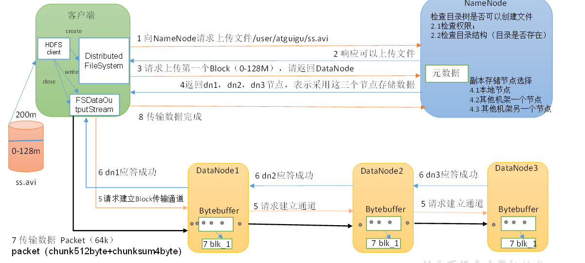

## HDFS 文件执行流程
### 1.1 HDFS的写数据流程

    1.客户端通过DistributedFileSystem模块向NameNode请求上传文件，NameNode检查目标文件是否已经存在,父目录是否存在。  
    2.NameNode返回是否可以上传。  
    3.客户端请求第一个Block上传到哪几个DataNode服务器上  
    4.NameNode返回三个DataNode节点，分别为dn1,dn2,dn3  
    5.客户端通过FSDataOutputStream模块请求dn1上传数据，dn1收到请求会继续调用dn2,然后dn2调用dn3，将这个通信管道建立完成。  
    6.dn1,dn2,dn3 逐级应答客户端  
    7.客户端开始往dn1上传第一个Block（先从磁盘读取数据放到一个本地内存缓存）,以Packet为单位，dn1收到一个Packet就会传给dn2，dn3传给dn3;dn1每传一个packet会放入一个应答队列等待应答  
    8.当一个Block传输完成后，客户端再次请求NameNode上传第二个Block的服务器。（重复执行3-7步）  
### 1.2 网络拓扑-节点距离计算  
   在HDFS写数据的过程中，NameNode会选择距离待上传数据最近距离的DataNode接收数据。（节点距离：两个节点到最近的共同祖先的距离总和）

