### uml基本介绍  
1) 一种用于软件系统分析和设计的工具，用于帮助软件开发人员进行思考和记录思路的结果。  
2) 本身是一套符号规定，描述软件模型中的各个元素和他们之间的关系
3) UML建模工具 Rose等.  
##### 类图及其关系介绍
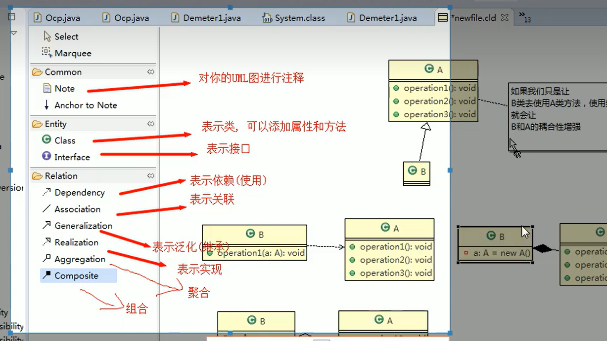
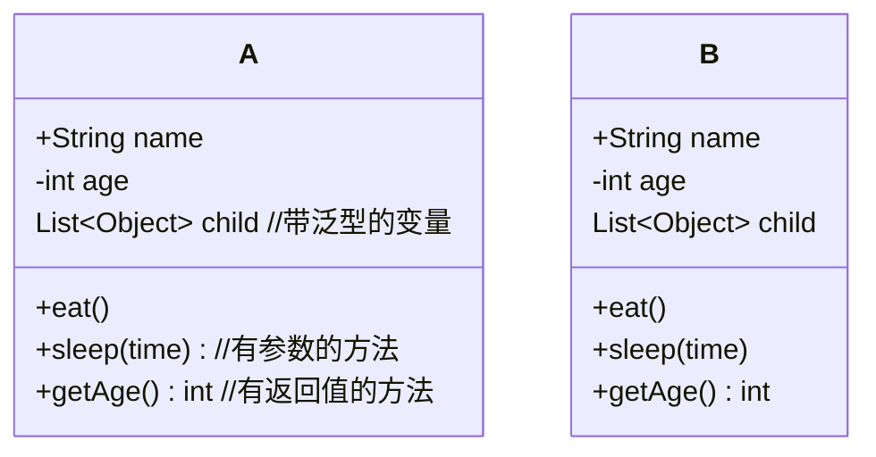
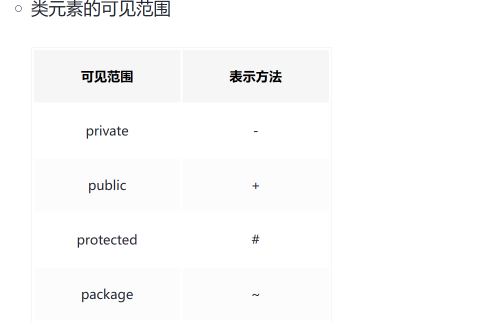  
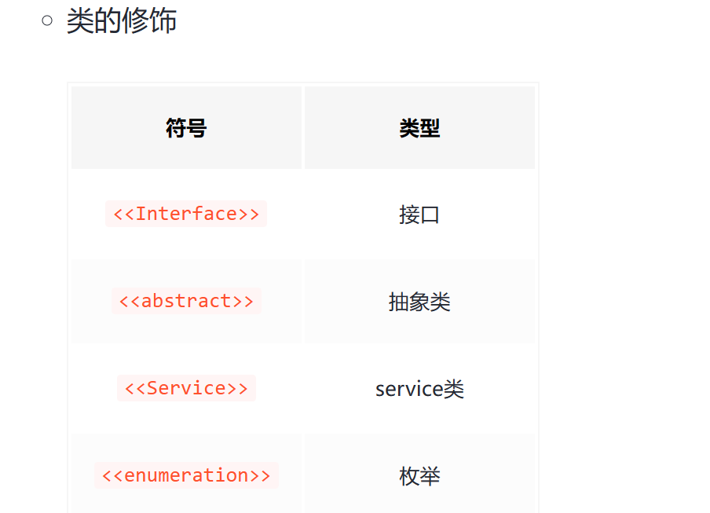  

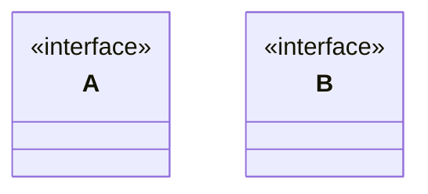
泛化：   
是一种继承关系，表示子类继承父类的所有特征和行为。  
表示：使用带三角箭头的实线，箭头指向父类。

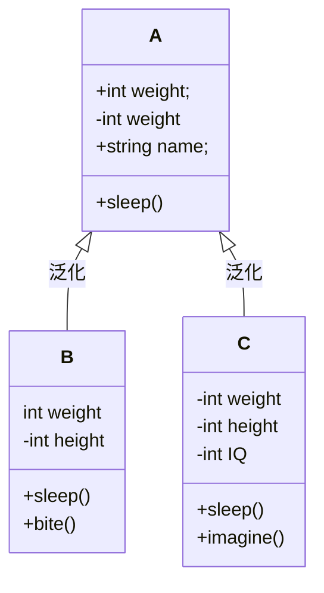
实现：  
定义：类实现接口或者抽象类，表示类是接口所有特征和行为的实现  
表示：带三角箭头的虚线，箭头指向接口或抽象类。  

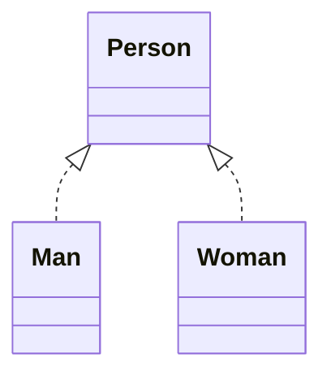
组合：  
定义：是一种整体与部分的关系，但部分不能离开整体而单独存在，随整体的创建而创建，称为强聚合（也属于关联关系的一种），要求代表整体的对象负责代表部分的对象的生命周期。  
表示：带实心菱形的实线，实心菱形指向整体。

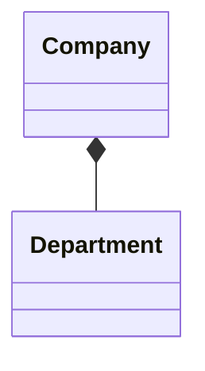
聚合：  
定义：是一种整体与部分的关系，且部分可以离开整体而单独存在，是关联关系的一种，强关联关系。关联和聚合在语法上无法区分，必须考察具体的逻辑关系。  
表示：带空心菱形的实现，空心菱形指向整体。  
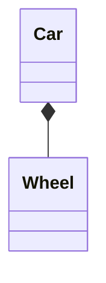
关联：  
定义：是一种拥有的关系，它使一个类知道另一个类的属性和方法；关联可以是双向的，也可以是单向的。双向的关联可以有两个箭头或者没有箭头，单向的关联有一个箭头。  
表示：带普通箭头的实心线，指向被拥有者。
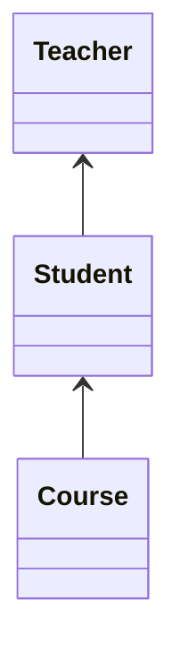
依赖：  
定义：是一种使用关系，即一个类的实现需要另一个类的协助。  
表示：带普通箭头的虚线，箭头指向被使用者。

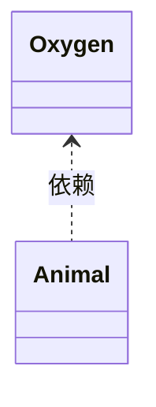

