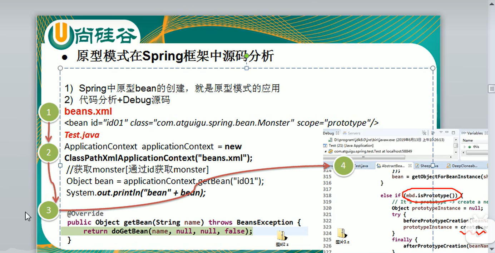

## 原型模式  
##### 基本介绍  
1. 原型模式是指：用原型实力指定创建对象的种类，并且通过拷贝这些原型，创建新的对象。  
2. 原型模式是一种创建型的设计模式，允许一个对象再创建另外一个可制定的对象，无需知道如何创建的细节。
3. 方式：对象.clone();  
   
#### 原型模式再Spring中源码框架分析
  
###### 浅拷贝  
1.  对于数据类型是基本数据类型的成员变量，浅拷贝会直接进行值传递，也就是将属性赋值给一份新的对象。  
2. 对于数据类型是引用数据类型的成员变量，浅拷贝会进行引用传递，也就是将该成员变量的引用值复制一份给新对象。在这种情况下，在一个对象中修改该成员变量会影响到另一个对象的该成员变量。  
3. 浅拷贝是使用默认的clone方法来实现。    
##### 深拷贝  
1. 复制对象的所有基本数据类型的成员变量
2. 为所有引用数据类型的成员变量申请存出空间，并复制每个引用数据类型成员变量所引用的对象，直到该对象可达的所有对象。也就是说，对象进行深拷贝要对整个对象进行拷贝。
3. 深拷贝实现方式
   1. 重写clone方法来实现深拷贝
   2. 通过对象序列化实现深拷贝
##### 原型模式的注意事项和细节  
1. 创建新的对象比较复杂时，可以使用原型模式简化对象的创建过程,同时也能够提供高效率。
2. 不用重新初始化对象,而是动态地获取对象运行时地状态
3. 弱国原始对象发生变化，其他克隆对象的也会发生相应的改变，无需求该代码
4. 在实现深克隆时，可能需要比较复杂的代码。
5. 
