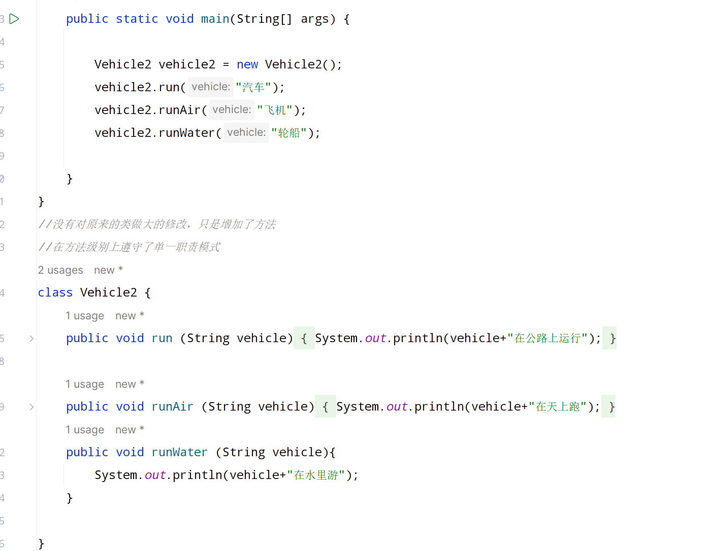
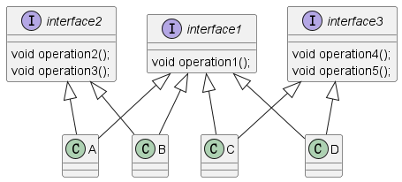

## JAVA设计模式

#### 一、设计模式的目的  
编写软件的过程中，程序员面临着来自耦合性，内聚性以及可维护性，可扩展性，重用性，灵活性等多方面的挑战。设计模式是为了让程序具有更好的.  
1)  代码重用性(相同功能的代码，不用多次编写)
2) 可读性(编程规范)
3) 可扩展性(增加新功能时，非常方便)
4) 可靠性
5) 使程序呈现高内聚，低耦合的特性   

### 二、设计模式的七大原则
1) 单一职责
2) 接口隔离原则
3) 依赖倒转原则
4) 里氏替换
5) 开闭原则
6) 迪米特原则
7) 合成复用原则

#### 2.1 单一职责模式  
对类来说，即一个类应该只负责一项职责，如类A负责两个不同职责:职责1，职责2。当职责1需求变更而改变A时，可能造成职责2执行错误，所以需要将类A的粒度分解为A1,A2.  
###### 应用
  
##### 说明和细节  
1) 降低类的复杂度，一个类只负责一项职责
2) 提高类的可读性，可维护性
3) 降低变更引起的风险
4) 通常情况下，我们应当遵守单一职责原则，只有逻辑足够简单，才可以在代码级违反单一职责;只有类中方法数量足够少，可以在方法级别中保持单一职责原则。  

#### 2.2接口隔离原则  
##### 基本介绍
1) 客户端不应该依赖它不需要的接口,即一个类对应另一个类的依赖应该建立在最小的接口上。

