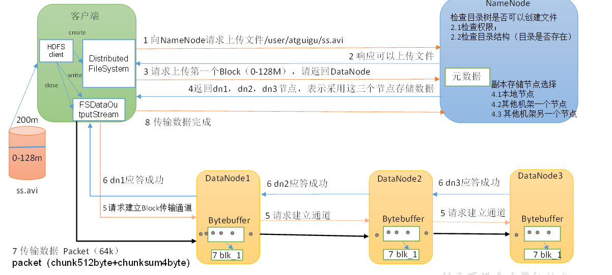
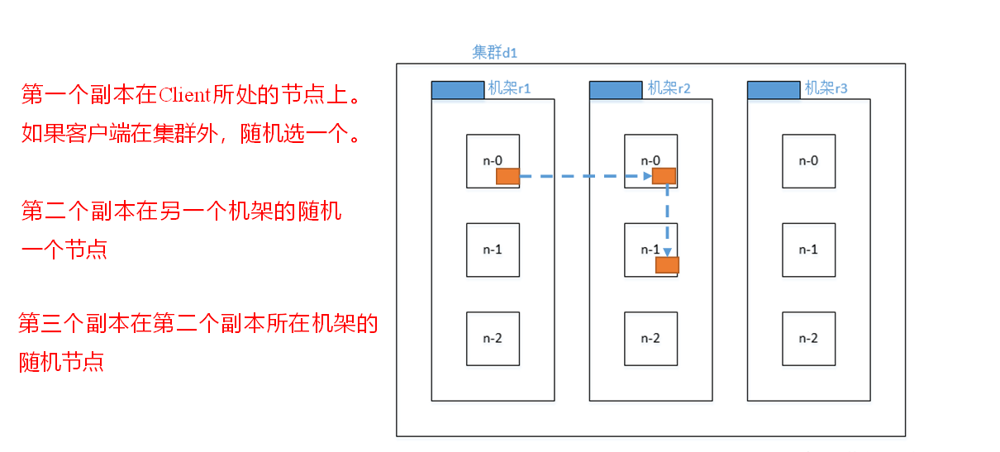
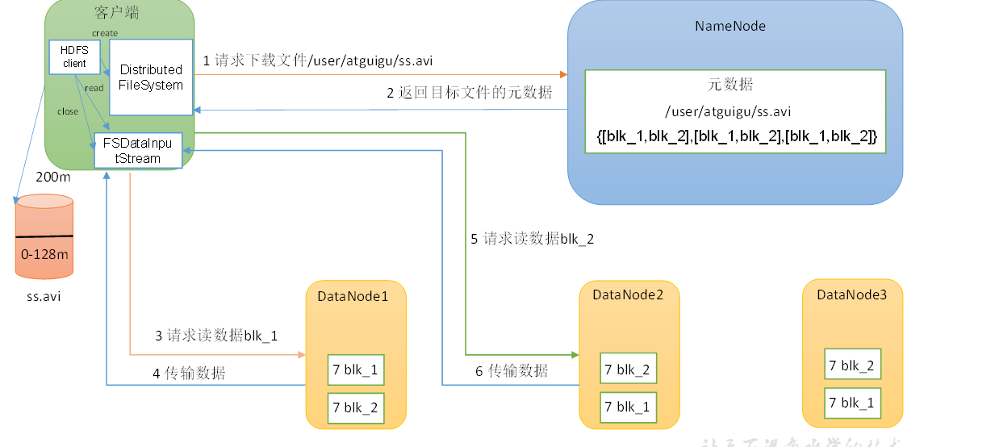
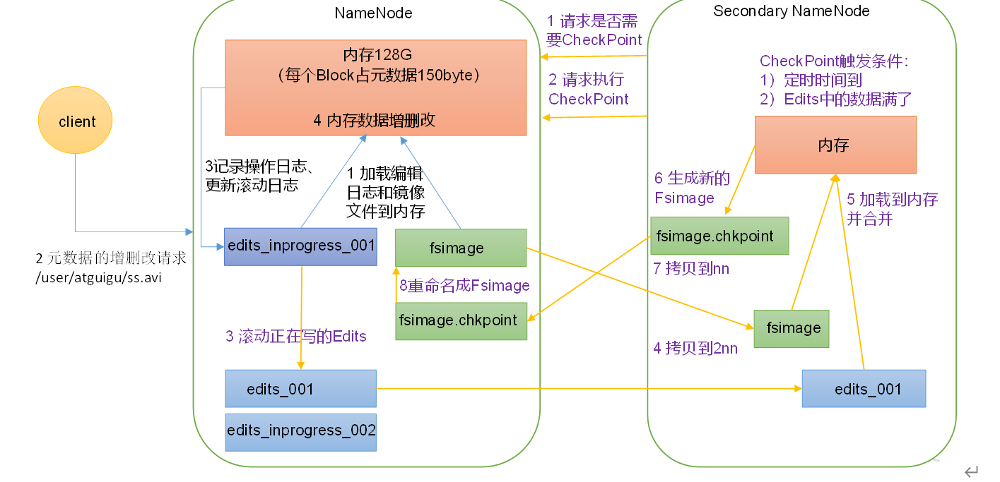
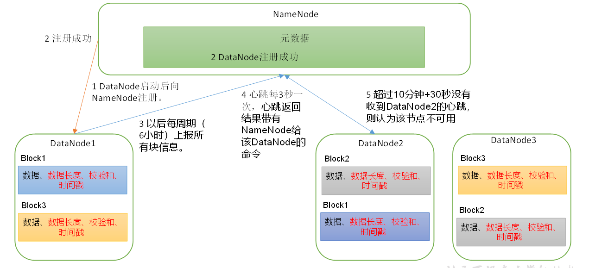
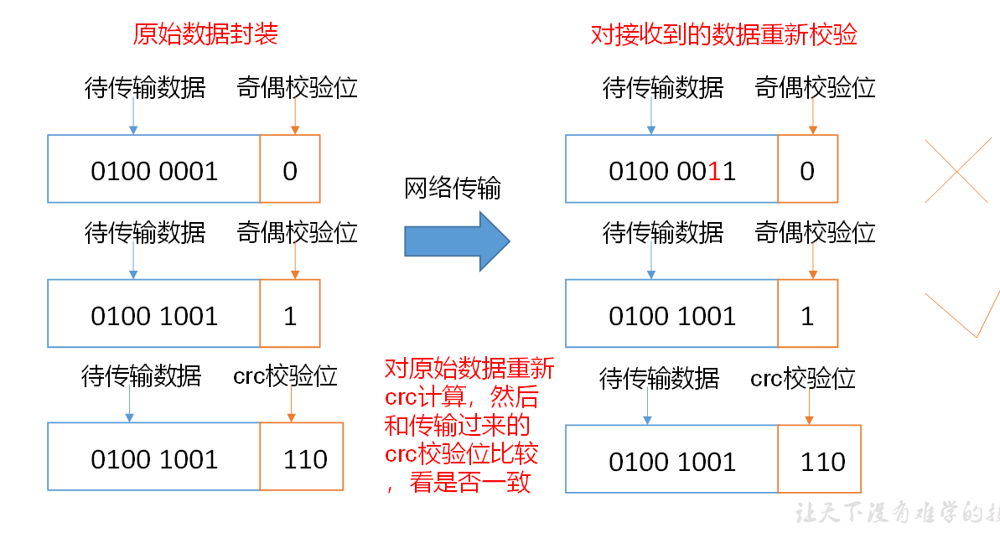
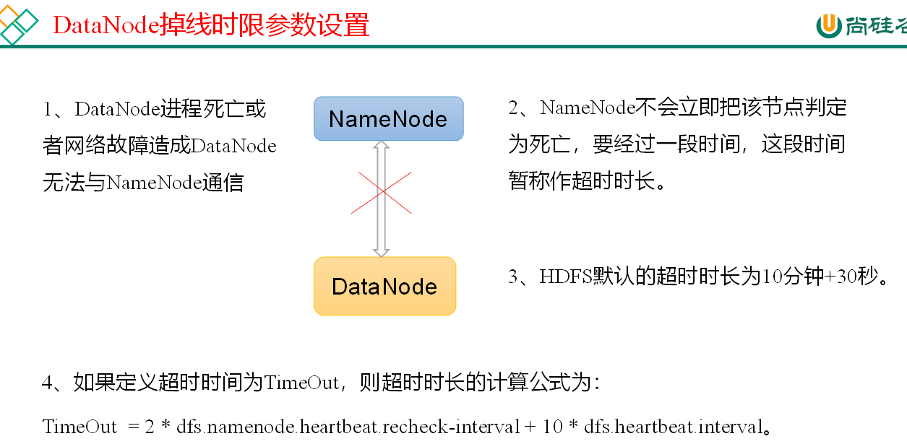

## HDFS 文件执行流程
### 1.1 HDFS的写数据流程

    1.客户端通过DistributedFileSystem模块向NameNode请求上传文件，NameNode检查目标文件是否已经存在,父目录是否存在。  
    2.NameNode返回是否可以上传。  
    3.客户端请求第一个Block上传到哪几个DataNode服务器上  
    4.NameNode返回三个DataNode节点，分别为dn1,dn2,dn3  
    5.客户端通过FSDataOutputStream模块请求dn1上传数据，dn1收到请求会继续调用dn2,然后dn2调用dn3，将这个通信管道建立完成。  
    6.dn1,dn2,dn3 逐级应答客户端  
    7.客户端开始往dn1上传第一个Block（先从磁盘读取数据放到一个本地内存缓存）,以Packet为单位，dn1收到一个Packet就会传给dn2，dn3传给dn3;dn1每传一个packet会放入一个应答队列等待应答  
    8.当一个Block传输完成后，客户端再次请求NameNode上传第二个Block的服务器。（重复执行3-7步）  
### 1.2 网络拓扑-节点距离计算  
   在HDFS写数据的过程中，NameNode会选择距离待上传数据最近距离的DataNode接收数据。（节点距离：两个节点到最近的共同祖先的距离总和)  
#### 副本节点选择  
  
### HDFSD的读数据流程  
  
1.  客户端通过DistributedFileSystem向NameNode请求下载文件，NameNode通过查询数据元素，找到文件块所在的DataNode地址。
2. 挑选一台DataNode(就近原则，然后随机)服务器，请求读取数据
3. DataNode开始传输数据给客户端
4. 客户端以Packet为单位接收，现在本地缓存，然后写入目标文件。


## NameNode和SecondryNameNode  
### NN和2NN工作机制  
#### NameNode工作机制  
  
第一阶段：
1) 第一次启动NameNode格式化后，创建Fsimage和Edits文件。如果不是第一次启动，直接加载编辑日志和镜像文件到内存。  
2) 客户端对元数据进行增删改查的请求
3) NameNode记录操作日志，更新滚动日志
4) NameNode在内存中对元数据进行增删改
第二阶段:  
1) SecondryNameNode 询问 NameNode是否需要CheckPoint，直接带回NameNode是否检查结果
2) NameNode滚动正在写的Edits日志
3) 将滚动前的编辑日志和镜像文件拷贝到SecondryNameNode
4) 生成新的镜像文件fsimage.checkpoint
5) 拷贝到fsimage.checkpoint到NameNode
6) NameNode将fsimage.checkpoint重新命名成fsimage

## Fsimage和Edits解析  
#### 概念    
  
1) Fsimage文件： HDFS文件系统元数据的一个永久性的检查点，其中包含HDFS文件系统的所有目录和文件inode的序列信息。  
2) Edits文件：存放HDFS文件系统的所有更新操作的路径，文件系统客户端执行的所有写操作首先会被记录到Edits文件中。  
3) seen_txid文件保存的是一个数字，就是最后一个edits_的数字
4) 每次NameNode启动的时候都会将Fsimage文件读入内存，加载Edits里面的更新操作，保证内存中的元数据信息是最新的，同步的，可以看成NameNode启动的时候就将Fsimage和Edits文件进行了合并。

#### oiv产看Fsimage文件
  ```shell
  hdfs
  ```
#### 基本语法 
```shell
hdfs oiv -p #  文件类型  

# 镜像文件  
hdfs oiv -i  

# 转换后文件输出路径  
hdfs oiv -o
```  
将显示的xml文件内容拷贝到Idea中创建的xml文件中，并且格式化。部分结果显示  
```xml
<inodes>
    <id>16386</id>
    <type>DIRECTORY</type>
    <name>user</name>
    <mtime>1512722284477</mtime>
    <permission>atguigu:supergroup:rwxr-xr-x</permission>
    <nsquota>-1</nsquota>
    <dsquota>-1</dsquota>

    <inode>
        <id>16387</id>
        <type>DIRECTORY</type>
        <name>atguigu</name>
        <mtime>1512790549080</mtime>
        <permission>atguigu:supergroup:rwxr-xr-x</permission>
        <nsquota>-1</nsquota>
        <dsquota>-1</dsquota>
    </inode>

    <inode>
        <id>16389</id>
        <type>FILE</type>
        <name>wc.input</name>
        <replication>3</replication>
        <mtime>1512722322219</mtime>
        <atime>1512722321610</atime>
        <perferredBlockSize>134217728</perferredBlockSize>
        <permission>atguigu:supergroup:rw-r--r--</permission>
        <blocks>
            <block>
                <id>1073741825</id>
                <genstamp>1001</genstamp>
                <numBytes>59</numBytes>
            </block>
        </blocks>
    </inode>
    
</inodes>
```  
在集群启动后，要求DataNode上报数据块信息，并间隔一段时间后再次上报。  
#### oev查看Edits文件  
#### 基本语法  
```shell
hdfs oev   
-p #文件类型 
-i #编辑日志 
-o  #转换后文件输出路径
```  
### CheckPoint 时间设置  
1) 通常情况下，SecondaryNameNode每隔一小时执行一次。  
 ```xml
<property>
  <name>dfs.namenode.checkpoint.period</name>
  <value>3600s</value>
</property>
```  
2) 一分钟检查一次操作次数，当操作次数达到1百万时，SecondaryNameNode执行一次。  
 ```xml
<description>
<property>
  <name>dfs.namenode.checkpoint.txns</name>
  <value>1000000</value>
<description>操作动作次数</description>
</property>

<property>
  <name>dfs.namenode.checkpoint.check.period</name>
  <value>60s</value>
<description> 1分钟检查一次操作次数</description>
</property>
</description>
```    
## DataNode 
### DataNode工作机制  
  
1) 一个数据块在DataNode上以文件形式存储在磁盘上，包括两个文件，一个是数据本身，一个是元数据包括数据块的长度，块数据的校验和，以及时间戳。  
2) DataNode启动后向NameNode注册，通过后，周期性的向NameNode上报所有的信息。  
3) DN向NN汇报当前解读信息的时间间隔默认6小时  
```xml
<property>
    <name>dfs.blockreport.intervalMsec</name>
    <value>21600000</value>
    <description>Determines block reporting interval in milliseconds.</description>
</property>
```  
DN扫描自己的节点块信息列表的时间，默认6小时。  
```xml
<property>
	<name>dfs.datanode.directoryscan.interval</name>
	<value>21600s</value>
	<description>Interval in seconds for Datanode to scan data 

directories and reconcile the difference between blocks in memory and on the disk.
	Support multiple time unit suffix(case insensitive), as described
	in dfs.heartbeat.interval.
	</description>
</property>
```
4) 心跳是每3秒一次，心跳返回结果带有NameNode给该DataNode的命令如复制块数据到另一台机器，或删除某个数据块。如果超过1omin没有收到某个DataNode的心跳，则认为该节点不用。  
5) 集群运行中可以安全加入和退出一些机器。  
### 数据完整性  
1. 当DataNode读取Block的时候，它会计算CheckSum。
2. 如果计算后的CheckSum，与Block创建时不一致，说明Block已经损坏。
3. Client读取其他DataNode上的Block。
4. 常见的校验算法 crc，md5，sha1  
5. DataNode在其创建后周期验证CheckSum。
  
#### 掉线时限参数设置  

而默认的dfs.namenode.heartbeat.recheck-interval 大小为 5 分钟，dfs.heartbeat.interval默认为3秒。 需要注意的是hdfs-site.xml配置文件中的heartbeat。recheck。interval的单位是毫秒，dfs.heartbeat.interval的单位为秒。  
```xml

<property>
    <name>dfs.namenode.heartbeat.recheck-interval</name>
    <value>300000</value>
</property>

<property>
    <name>dfs.heartbeat.interval</name>
    <value>3</value>
</property>
```


