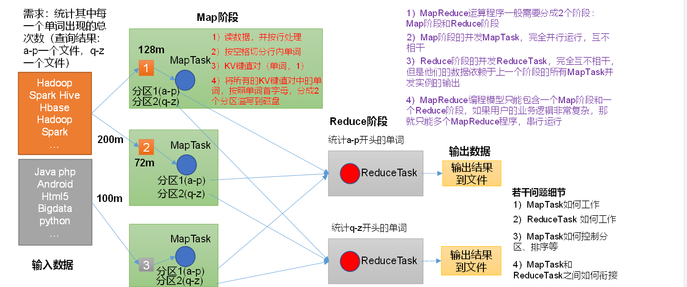

# MapReduce  
## MapReduce概述  
#### 定义  
MapReduce 是一个分布式运算程序的编程框架，是用户开发”基于Hadoop的数据分析应用“的核心框架。Mapreduce核心功能是将用户编写的业务逻辑代码和自带默认组件整合成一个完整的分布式运算程序，并且运行在一个Hadoop集群上。  
## 优缺点  
### 优点  
1) 易于编程
它简单的实现一些接口，就可以完成一个分布式程序，整个分布式程序可以分布到大量廉价的pc机上运行。
2) 良好的扩展性  
当你的计算资源不能得到满足的时候，可以通过简单的增加机器来扩展它的计算能力。
3) 高容错性
4) 适合PB级别以上海量数据的离线处理
### 缺点  
1) 不擅长实时计算
2) 不擅长流式计算
3) 不擅长DAG(有向无环图)计算  
使用后，每个MapReduce作业的输出结果都会写入到磁盘，会造成大量的磁盘IO，导致性能非常低下。 
#### 核心思想  
  
1) 第一阶段的MapTask并发实例，完全并行运行，互不相干。
2) 第二个阶段的ReduceTask并发实例互不相干，但是他们的数据依赖于上一个阶段的所有MapTask并发实例的输出。  
3) MapReduce编程模型只能包含一个Map阶段和一个Reduce阶段，如果用户的业务逻辑非常复杂，那就只能多个MapReduce程序，串行运行。  
##### MapReduce进程  
一个完整的MapReduce程序在分布式运行时有三类实例进程：
1) MrAppMaster:负责整个程序的过程调度及状态协调。  
2) MapTask：负责Map阶段的整个数据处理流程。
3) ReduceTask:负责Reduce阶段的整个数据处理流程。  
##### MapReduce变成规范  
1) Mapper阶段：
   1) 用户自定义的Mapper要继承自己的父类。
   2) Mapper的输入数据是KV的形式(kv的类型可自定义)
   3) Mapper的输出数据是kv对的形式
   4) Mapper中的业务逻辑写在map()方法中
   5) map()方法对每一个<k,v>调用一次。
2) Reducer阶段
   1) 用户自定义的Reducer要继承自己的父类
   2) Reducer的输入数据类型对应Mapper的输出类型，也是KV
   3) Reducer的业务逻辑写在reduce()方法中
   4) ReduceTask进程对每一组相同的k的<k ,v>组调用一次reduce()方法
3) Driver阶段  
    相当于YARN集群的客户端，用于提交我们只能整个程序到YARN集群，提交的是封装了MapReduce程序相关运行参数的JOB对象。   


#### 序列化  
#### 什么是序列化  
   序列化就是把内存中的对象，转换成字节序列或其它数据传输协议，以便存储到磁盘和网络传输。  
#### Hadoop序列化特点  
1) 紧凑：高效使用存储空间
2) 快速：读写数据的额外开销小
3) 互操作：支持多语言的交互  
###### bean对象实现序列化的步骤  
1) 实现Writable接口  
2) 反序列化时，需要反射调用空参构造函数，所以必须有空参构造。
```java
public void FlowBean(){
    super()
        }
```
3) 重写序列化方法
```java
@Override
public void write(DataOutput out) {
        out.writeLong(upFlow);

        out.writeLong(downFlow);

        out.writeLong(sumFlow);

        }
```      
4) 重写序列化方法
```java
@Override
public void readFiles(DataOutput out)

        upFlow = in.readLong();

        downFlow= in.readLong();

        sumFlow= in.readLong();


```  
（5）注意反序列化的顺序和序列化的顺序完全一致

（6）要想把结果显示在文件中，需要重写toString()，可用"\t"分开，方便后续用。

（7）如果需要将自定义的bean放在key中传输，则还需要实现Comparable接口  
#### MapReduce框架原理  
  
##### InputFormat 数据输入
###### 切片与MapTask 并行度决定机制  
MapTask的并行度决定Map阶段的任务处理并发度，进而影响到整个Job的处理速度。  
1) MapTask并行度决定机制  
数据块：Blocks是物理上把数据分成一块儿一块儿，数据块是HDFS存储数据单位。  
数据切片：数据切片只是在逻辑上对输入进行分片，并不会在磁盘将其分片存储。数据切片是Mapreduce程序计算输入数据的单位，一个切片会对应启动一个MapTask。  
    
#### Job提交示例流程  
  
##### FileInputFormat切片源碼分析  
1) 程序先找到你数据存储的目录。
2) 开始遍历处理目录下的每一个文件
3) 遍历第一个文件.txt   
   1) 获取文件大小fs.sizeOf(ss.text)
   2) 计算切片大小
   3) 默认情况下，切片大小=blocksize
   4) 开始切，形成切片(每次切片时，都要判断切完剩下的部分是否大于块的1.1倍，不大于1.1就划分一块切片) 
   5) 将切片信息写到一个切片规划文件中
   6) 整个切片的核心过程在getSplit()方法中完成。
   7) InputSplit 只记录了切片的元数据信息，比如起始位置，长度以及所在节点列表等。
4) 提交切片到Yarn上，YARN的MrAppMaster就可以根据切片规划文件计算开启MapTask个数。
#### FileInputFormat切片机制  
######  切片机制  
1)  简单地寻找文件的长度进行切片。 
2) 切片大小，默认等于block大小。  
3) 切片时不考虑数据集整体，而是逐个针对每一个单独文件切片。   
  
##### 切片大小设置
maxsize(切片最大值):参数如果调得比blockSize小，则会让切片变小，而且就等于配置的这个参数的值。  
minsize(切片最小值):参数调的比blockSize大,则可以让切片变得比blockSize还大。  
##### 获取切片信息API  
```java 
public class test {
    String name = inputSplit.getPath().getName();
    // 根据文件类型获取切片信息
    FileSplit inputSplit = (FileSplit) context.getInputSplit();
}
```    

### TextInputFormat  
#### FileInputFormat实现类  
     
FileInput 常见的接口实现类包括：TextInputFormat、keyValueTextInputformat等。  
TextInputFormat是默认的FileInputFormat实现类，按行读取每条记录。键是存储该行在整个文件中的起始字节偏移量，LongWritable类型，值是这行的内容，不包括任何行终止符。  
### CombineTextInputFormat切片机制  
框架默认的TextInputforMat切片机制是对任务按文件规划切片，不管文件多小，都会是一个单独的切片，都会交给一个MapTask，如果有大量小文件的，就会产生大量的MapTask,处理效率低下。
1) 应用场景：  
  CombineTextInputFormat 用于小文件过多的场景，它可以将多个小文件从逻辑上规划到一个切片中，这样，多个小文件就可以交给一个MapTask处理。
2) 虚拟存储器切片最大值设置
   CombineTextInputFormat.setMaxInputSplitSize(job, 4194304) // 4MB

##### MapReduce详细工作流程  
  
  
具体Shuffle过程详解：  
1) MapTask 收集我们的map方法输出的kv对，放到内存缓冲区。
2) 从内存缓冲区不断溢出本地磁盘文件，可能会溢出多个
3) 多个溢出文件会被合并成大的溢出文件
4) 在溢出过程及合并过程中，都要调用Partitioner进行分区和针对key进行排序
5) ReduceTask 根据自己的分区号,去各个MapTask机器上取相应的结果
6) ReduceTask会抓取到同一个分区的来自不同MapTask的结果文件，ReduceTask会将这些文件在进行合并(归并排序)
7) 合并称为大文件后,Shuffle的过程也就结束了，后面进入ReduceTask的逻辑运算过程。
###### 注意：  
1) Shuffle中的缓冲区大小会影响到MapReduce程序的执行效率，原则上说，缓冲区越大，磁盘io的次数越少，执行速度就越快。  
2) 缓冲区的大小可以通过参数调整。参数：mapreduce.task.io.sort.mb 默认 100M。
#### Shuffle机制  
#### 1.1 机制  
Map方法之后，Reduce方法之前的数据处理过程称之为Shuffle。

#### 1.2 partition 分区  
  
1. 默认分区是根据key的hashCode对ReduceTask个数取模得到的。用户没法控制哪个key存储到哪个分区。
2. 自定义partitioner步骤
   1. 自定义继承Partitioner,重写getPartition()方法
   2. 在Job中，设置自定义Partitioner
   3. 自定义Partition后，要根据自定义Partitioner的逻辑设置相应数量的ReduceTask。
3. partition总结 
   1. 如果ReduceTask的数量>getPartition的结果数，则会多产生几个空的输出文件part-r-00xx;
   2. 如果1< ReduceTask的数量<getPartition的结果数,则有一部分分区数据无处安放,会Exception。
   3. 如果等于一，则不管MapTask端输出多少个分区文件，最终结果都交给这一个ReduceTask,最终也就只会产生一个结果文件part-r-00000;
   4. 分区号必须从零开始，逐一增加。


