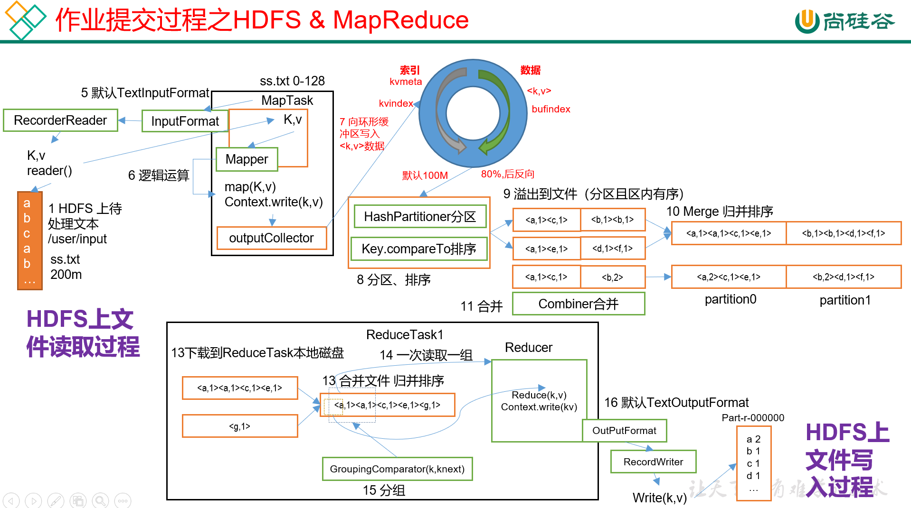
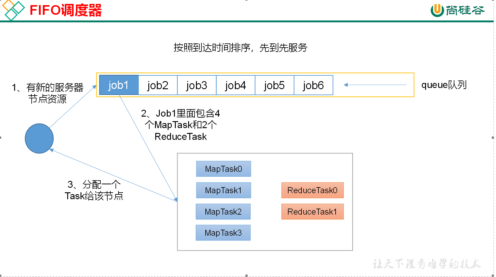
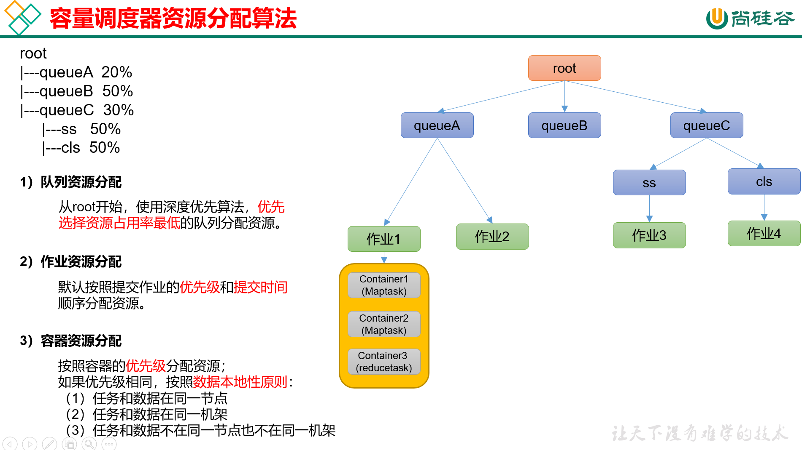
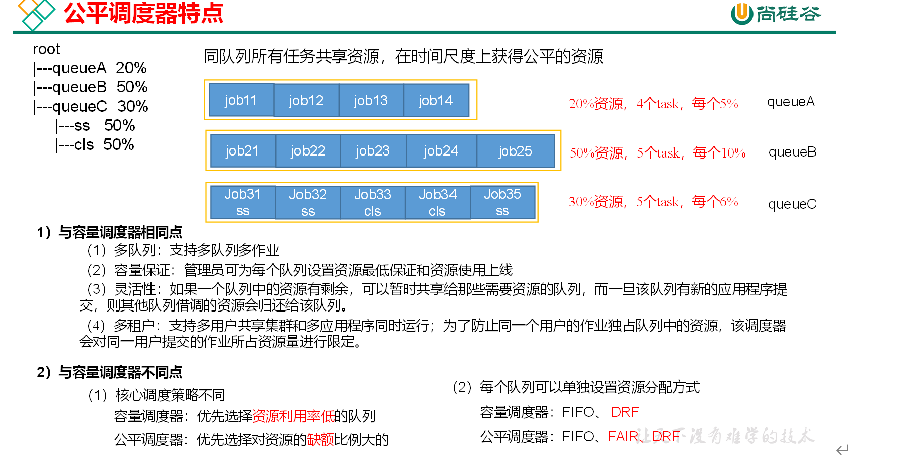
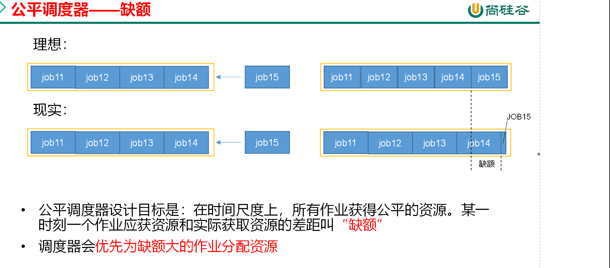
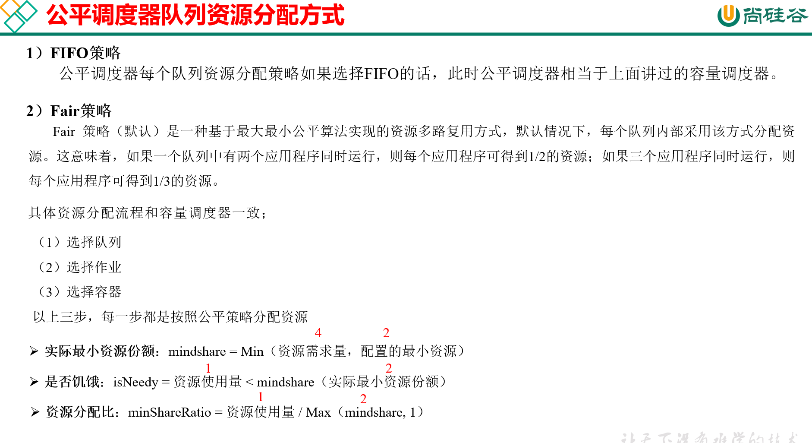
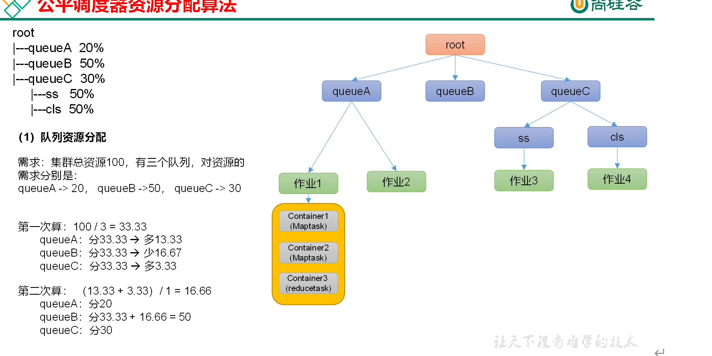
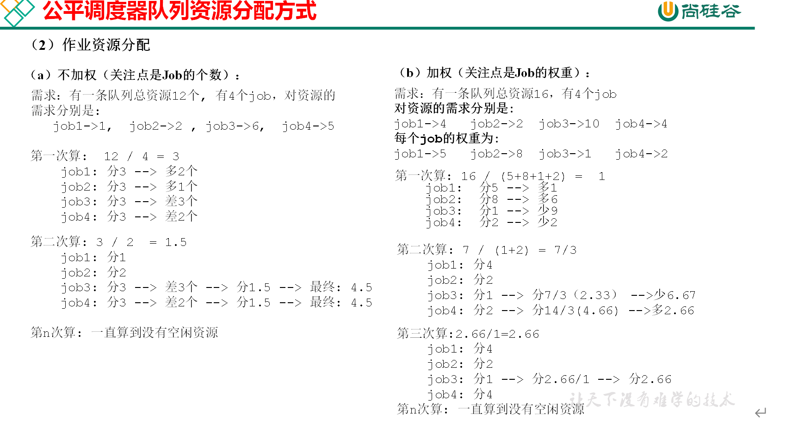
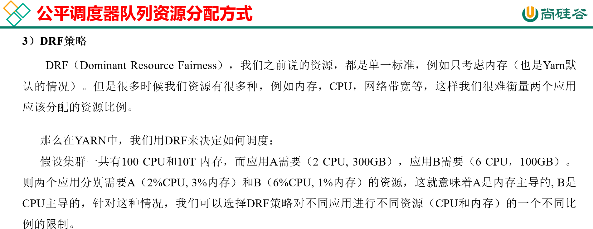
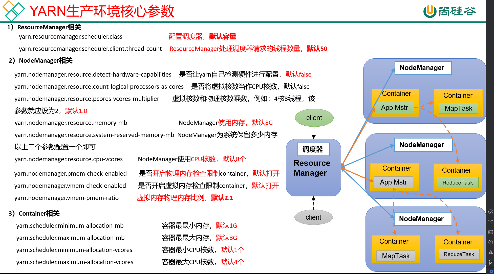

## YARN-资源调度其器  
YARN 是一个资源调度平台，负责为运算程序提供服务器资源，相当于一个分布式的操作系统平台，而MapReduce等运算程序则相当于运行于操作系统之上的应用程序。  
### 1.1 Yarn基础架构  
Yarn主要由ResourceManager,NodeManager,ApplicationMaster和Container等组件构成。  
  
### 1.2 Yarn工作机制  
  
1) MR程序是提交到客户端所在的节点。  
2) YarnRunner向ResourceManager申请一个Application。
3) RM将向应用程序的资源路径返回给YarnRunner。
4) 该程序将运行所需资源资源提交到HDFS上。
5) 程序将资源提交完毕后，申请运行mrAppMaster。
6) RM将用户的请求初始化成为一个Task。
7) 其中一个NodeManager领取任务。
8) 该NodeManager创建容器Container,并产生MRAppmaster。
9) Container从HDFS上拷贝资源到本地。
10) MRAppmaster向RM申请运行MapTask资源。
11) RM将运行MapTask任务分配给另外两个NodeManager，另外两个NodeManager分别领取任务并创建容器。
12) MR向两个接收到任务的NodeManager发送程序启动脚本，这两个NodeManager分别启动MapTask,MapTask对数据进行分区排序。
13) MRAppMaster等待所有MapTask运行完毕后，向RM申请容器,运行ReduceTask。
14) ReduceTask向MapTask获取相应的分区数据。
15) 程序完毕后，MR会向RM申请注销自己。  

### 作业提交全过程

##### Yarn提交过程  
  
##### 作业提交过程之HDFS&MapReduce  
  
##### 作业提交全过程详解  
###### (1) 作业提交  
1. Client 调用job.waitForCompletion 方法,像整个集群提交MapReduce作业。
2. Client向R申请一个作业id。
3. RM给Client返回该Job资源的提交路径和作业id
4. Client提交jar包、切片信息和配置文件到指定的资源提交路径。
5. Client提交万资源后，向RM申请运行MrApplicationMaster。
###### (2) 作业初始化  
1. 当RM收到Client的请求后，将该job添加到容器调度器中
2. 某一个空闲的NM领取到该Job。
3. 该NM创建Container,并产生MRAppMaster。
4. 下载Client提交的资源到本地。
###### (3) 任务分配  
1. MrAppMaster 向RM申请运行多个MapTask任务资源。
2. RM将运行MapTask任务分配给另外两个NodeManager，另外两个NodeManager分别领取任务并创建容器。  
###### (4) 任务运行  
1. MR向两个接收到任务的NodeManager发送程序启动脚本，这两个NodeManager分别启动MapTask，MapTask对数据分区排序。
2. MRAppMaster等待所有MapTask运行完成后，向RM申请容器，运行ReduceTask。
3. ReduceTask向MapTask获取相应分区的数据。
4. 程序运行完毕后，MR会向RM申请注销自己。
###### (5) 进度和状态更新
ARN中的任务将其进度和状态(包括counter)返回给应用管理器, 客户端每秒(通过mapreduce.client.progressmonitor.pollinterval设置)向应用管理器请求进度更新, 展示给用户。  
###### (6) 作业完成  
除了向应用管理器请求作业进度外, 客户端每5秒都会通过调用waitForCompletion()来检查作业是否完成。时间间隔可以通过mapreduce.client.completion.poll interval来设置。作业完成之后, 应用管理器和Container会清理工作状态。作业的信息会被作业历史服务器存储以备之后用户核查。

### Yarn调度器和调度算法  
目前,Hadoop 作业调度有三种：FIFO,容量调度器，公平调度器。 具体设置详见：yarn-default.xml文件。  
#### 先进先出调度器(FIFO)  
FIFO 调度器：单队列，根据提交作业的先后顺序，先来先服务。  
  
优点： 简单易懂  
缺点：不支持多队列,生产环境很少使用。  
##### 容量调度器  
Capacity Scheduler是Yahoo开发的多用户调度器。  
  
1. 多队列:每个队列可配置一定的资源量,每个队列采用FIFO调度策略。
2. 容量保证:管理员可为每个队列设置资源最低保证和资源使用上限。  
3. 灵活性:如果一个队列中的资源有剩余，可以在暂时共享给那些需要资源的队列,而一旦该队列有新的应用程序提交，则其他队列借调的资源会归还给该队列。  
4. 多租户：
   1. 支持多用户共享集群和多应用程序同时运行。
   2. 为了防止同一个用户作业独占队队列中的资源，该调度器会对同一用户提交的作业所占资源量进行限定。  

  

#### 公平调度器  
FairSchedulere 是 FaceBook开发的多用户调度器。  
  
  

  

  
#### YARN 生产环境核心参数  

