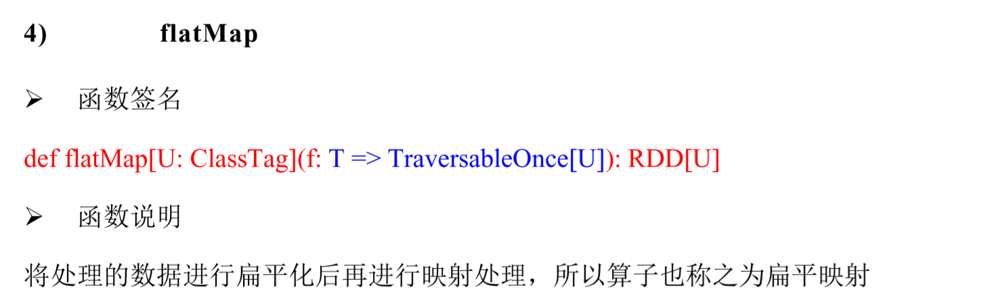

# spark运行框架   
#### 运行架构  
Spark框架的核心是一个计算引擎，整体来说，它采用了标准master-slaver的结构。Driver表示master，负责整个集群中的作业调度。Executor则是slave。负责执行任务。
  
#### 核心组件  
Spark 驱动器节点，用于执行Spark任务中的main方法，负责实际代码的执行工作。Driver在Spark作业执行时主要负责： 
1. 将用户程序转化为作业(job)
2. 在Executor之间调度任务
3. 跟踪Executor的执行情况
4. 通过UI展示查询运行情况。
#### Executor 
1. 负责运行组成spark 应用的任务，并将结果返回给驱动进程。
2. 通过自身的块管理器为用户程序中要哦求缓存的RDD提供内存式存储。RDD是直接缓存在Executor进程内的，因此任务可以在运行时充分利用缓存数据加速运算。  
#### Master&Worker 
spark集群的独立部署环境中，不需要依赖其他的资源调度框架，自身就实现了资源调度的功能，所以环境中还有其他两个核心组件，Master和Worker，这里的Master是一个进程，主要负责资源的调度和分配，并进行集权的监控等职责，类似于Yarn环境中的RM，一个Worker运行在集群中的一台服务器上，由Master分配资源对数据进行并行的处理和计算，类似于Yarn环境中的NM.
#### ApplicationMaster  
Hadoop用户向Yarn集群提交应用程序时，提交程序中应该包含ApplicationMaster，用于向资源调度器申请执行任务的资源容器Container，运行用户自己的程序任务Job,加农整个任务的执行，跟踪整个任务的状态，处理任务失败等异常情况。
## 核心概念
### Executor与Core
  Spark Executor是集群中运行在工作节点(Worker)中的一个JVM进程，是整个集群中的专门用与计算的节点。在提交应用中，可以提供餐无数指定计算节点的个数，以及对应的资源。这里的资源一般指的是工作节点Executor的内存大小和使用的虚拟CPU和数量。
    
### 并行度    
在分布式计算框架中一般都是指多个任务同时执行，由于任务分布在不同的计算节点进行计算，所以能够真正的实现多任务并行执行。
### 有向无环图(DAG)
  
由spark程序直接映射成的数据流的高级抽象模型，简单理解就是将整个程序计算的执行过程用图形表示出来，这样更直观，更便于立=理解，可以用于表示程序的拓扑结构。
DAG有向无环图是由点和线组成的拓扑图形，该图形具有方向，不会闭环。
### 提交流程
所谓的提交流程，其实就是我们开发人员根据需求写的应用程序通过spark客户端提交给spark运行环境执行计算的流程。
  
Spark 应用程序提交到Yarn 环境中执行的时候，一般会有两种部署执行的方式：Client 和Cluster。两种模式主要区别在于：Driver 程序的运行节点位置。  
### YarnClient模式  
Client模式用于监控和调度的Driver模块在客户端执行，而不是在Yarn中，所以一般用于测试。  
1. Driver 在任务提交的本地机器上运行。
2. Driver 启动后会和ResourceManager 通讯申请启动ApplicationMaster
3. ResourceManager 分配 container，在合适的NodeManager 上启动ApplicationMaster，负 责向ResourceManager 申请 Executor 内存。
4. ResourceManager 接到ApplicationMaster 的资源申请后会分配 container，然后 ApplicationMaster 在资源分配指定的NodeManager 上启动 Executor 进程。
5. Executor 进程启动后会向Driver 反向注册，Executor 全部注册完成后Driver 开始执行 main 函数。
6. 之后执行到Action 算子时，触发一个 Job，并根据宽依赖开始划分 stage，每个 stage 生 成对应的TaskSet，之后将 task 分发到各个 Executor 上执行。
### YarnCluster 模式  
Cluster 模式将用于监控和调度的Driver 模块启动在Yarn 集群资源中执行。一般应用于 实际生产环境。
1. 在Yarn Cluster模式下，任务提交后会和ResourceManager通讯申请启动ApplicationMaster。
2. 随后ResourceManager分配 container，在合适的NodeManager 上启动ApplicationMaster， 此时的ApplicationMaster 就是Driver。
3. Driver 启动后向ResourceManager 申请 Executor 内存，ResourceManager 接到 ApplicationMaster 的资源申请后会分配 container，然后在合适的NodeManager 上启动
   Executor 进程。
4. Executor 进程启动后会向Driver 反向注册，Executor 全部注册完成后Driver 开始执行 main 函数。
5. 后执行到Action 算子时，触发一个 Job，并根据宽依赖开始划分 stage，每个 stage 生 成对应的 TaskSet，之后将 task 分发到各个 Executor 上执行

## 核心编程  
 spark 计算框架为了能够进行高并发和高吞吐的额数据处理，提供了了三种不同的数据结构，用于处理不同的应用场景，分别为：
 1. RDD：弹性数据分析
 2. 累加器：分布式共享只写变量
 3. 广播变量。  
### RDD 
RDD（Resilient Distributed Dataset）叫做弹性分布式数据集，是 Spark 中最基本的数据 处理模型。代码中是一个抽象类，它代表一个弹性的、不可变、可分区、里面的元素可并行
计算的集合。  
1. 弹性
   1. 存储的弹性:内存与磁盘的自动切换；
   2. 容错的弹性：数据丢失可以自动恢复；
   3. 计算的弹性：计算出错重试机制;
   4. 分片的弹性:可根据需要重新分片。
2. 分布式：数据存储在大数据集群不同节点上。
3. 数据集:RDD封装了计算逻辑，并不保存数据。
4. 数据抽象：RDD是一个抽象类，需要子类实现。
5. 不可变：RDD封装了计算逻辑，是不可以改变的,想要改变，只能添加新的RDD,在里面封装逻辑。 
6. 可分区、并行计算。
#### 核心属性  
 1. 分区列表:RDD数据结构中存在分区列表，用于执行任务时并行计算，是实现分布式计算的重要属性。
 2. 分区计算函数:Spark在计算时，是使用分区函数对每一个分区进行计算。
 3. RDD之间的依赖关系:RDD是计算模型的封装，当需求中需要将多个计算模型进行组合时，就需要将多个RDD建立依赖关系。
 4. 分区器:当数据为KV类型时，可以通过设定分区器自定义数据的分区。
 5. 首选位置：计算数据时，可以根据计算节点的状态选择不同的节点位置进行计算。
#### 执行原理
  从计算的角度讲，数据处理过程中需要计算资源(内存&CPU)和计算模型(逻辑)。执行时，需要将计算资源和计算模型进行整合。
  Spark框架在执行时，先申请资源，然后将应用程序的数据处理逻辑分解成一个个的计算任务。然后将任务发到已经分配资源的计算节点上，按照指定的计算模型进行数据计算，最后得到结果。
  RDD是Spark框架中用于数据处理的核心模型。  
#### 在 YARN 中 RDD的工作原理  

1. 启动Yarn集群环境  

    
2. Spark 通过申请资源创建调度节点和计算节点。 
      
3. Spark框架根据需求将计算逻辑根据区分划分成不同的任务。
    
4. 调度节点将任务根据计算节点状态发送到对应的计算节点进行计算。

#### RDD创建  
在Spark中创建RDD的创建方式可以分为四种:
1) 从集合中创建RDD，Spark 主要提供了两个方法：parallelize 和makeRDD.从底层代码来看，makeRDD方法其实就是parallelize方法。
  
  
2) 从外部文件(存储)创建RDD：由外部存储系统的数据集创建RDD包括：本地的文件系统，所有Hadoop支持的数据集比如HDFS,HBASE等。
     
3) 从其他RDD创建。主要是通过一个RDD运算完后，再产生新的RDD。
4) 直接创建RDD（new）：使用 new 的方式直接构造RDD，一般由 Spark 框架自身使用。  
#### RDD并行度 
默认情况下，spark可以将一个作业切分多个任务后，发送给Executor节点并计算,而能够并行计算的任务数量我们称之为并行度。这个数量可以在构建RDD时指定。读取内存数据时,数据可以按照并行度的设定进行数据的分区操作，数据分区规则的Spark核心源码如下：

#### RDD转换算子  
RDD根据数据处理方式的不同将算子整体上分为Value 类型、双Value 类型和Key-Value 类型
  
    
###### 思考一个问题：map 和mapPartitions 的区别？ 
1. 数据处理角度
   Map 算子是分区内一个数据一个数据的执行，类似于串行操作。而mapPartitions 算子 是以分区为单位进行批处理操作。
2. 功能的角度
   Map 算子主要目的将数据源中的数据进行转换和改变。但是不会减少或增多数据。 MapPartitions 算子需要传递一个迭代器，返回一个迭代器，没有要求的元素的个数保持不变，
   所以可以增加或减少数据。
3. 性能的角度  
 Map 算子因为类似于串行操作，所以性能比较低，而是mapPartitions 算子类似于批处 理，所以性能较高。但是mapPartitions 算子会长时间占用内存，那么这样会导致内存可能
   不够用，出现内存溢出的错误。所以在内存有限的情况下，不推荐使用。使用map 操作。
  

```scala
val dataRDD = sparkContext.makRDD(List(List(1,2),List(3,4)),1)
val dataRDD1 = dataRDD.flatMap( list => list)  
```
  
  
```scala
val dataRDD = sparkContext.makRDD(List(
  1,2,3,4
),4)
val dataRDD1:RDD[Array[Int]] = dataRDD.golm()
```


```scala 3
val dataRDD = sparkContext.makeRDD(List(List(1,2,3,4),4))
val dataRDD1 = dataRDD.groupBy( _%2)
```
  
```scala
val dataRDD = sparkContext.makeRDD(List(List(1,2,3,4),1))
val dataRDD1 = dataRDD.filter(_%2==0)  
```
  
```scala
val dataRDD = sparkContext.makeRDD(List( 1,2,3,4
),1) 
// 抽取数据不放回（伯努利算法） 
// 伯努利算法：又叫 0、1 分布。例如扔硬币，要么正面，要么反面。 
// 具体实现：根据种子和随机算法算出一个数和第二个参数设置几率比较，小于第二个参数要，大于不 要 
// 第一个参数：抽取的数据是否放回，false：不放回 
// 第二个参数：抽取的几率，范围在[0,1]之间,0：全不取；1：全取； /
// / 第三个参数：随机数种子
val dataRDD1 = dataRDD.sample(false, 0.5) 
// 抽取数据放回（泊松算法） 
// 第一个参数：抽取的数据是否放回，true：放回；false：不放回 
// 第二个参数：重复数据的几率，范围大于等于 0.表示每一个元素被期望抽取到的次数 
// 第三个参数：随机数种子
val dataRDD2 = dataRDD.sample(true, 2)
```

  
```scala
val dataRDD = sparkContext.makeRDD(List( 1,2,3,4,1,2
),1)
val dataRDD1 = dataRDD.distinct()
val dataRDD2 = dataRDD.distinct(2)  

```  
  
```scala
val dataRDD = sparkContext.makeRDD(List( 1,2,3,4,1,2
),6)
val dataRDD1 = dataRDD.coalesce(2)
```  

  
```scala
val dataRDD = sparkContext.makeRDD(List( 1,2,3,4,1,2
),2)
val dataRDD1 = dataRDD.repartition(4)  
```  
  
```scala
val dataRDD = sparkContext.makeRDD(List( 1,2,3,4,1,2),2)
val dataRDD1 = dataRDD.sortBy(num=>num, false, 4)  
```
  
  
```scala
val dataRDD1 = sparkContext.makeRDD(List(1,2,3,4)) 
val dataRDD2 = sparkContext.makeRDD(List(3,4,5,6))
val dataRDD = dataRDD1.intersection(dataRDD2)
```  
  
```scala
val dataRDD1 = sparkContext.makeRDD(List(1,2,3,4)) 
val dataRDD2 = sparkContext.makeRDD(List(3,4,5,6))
val dataRDD = dataRDD1.union(dataRDD2)
```  

```scala
val dataRDD1 = sparkContext.makeRDD(List(1,2,3,4)) 
val dataRDD2 = sparkContext.makeRDD(List(3,4,5,6))
val dataRDD = dataRDD1.subtract(dataRDD2)
```
  
```scala
val dataRDD1 = sparkContext.makeRDD(List(1,2,3,4)) 
val dataRDD2 = sparkContext.makeRDD(List(3,4,5,6))
val dataRDD = dataRDD1.zip(dataRDD2)
```  
  
```scala
import org.apache.spark.HashPartitioner
val rdd: RDD[(Int, String)] = sc.makeRDD(Array((1,"aaa"),(2,"bbb"),(3,"ccc")),3)
val rdd2: RDD[(Int, String)] = rdd.partitionBy(new HashPartitioner(2))
```  


```scala
val dataRDD1 = sparkContext.makeRDD(List(("a",1),("b",2),("c",3))) 
val dataRDD2 = dataRDD1.groupByKey() val dataRDD3 = dataRDD1.groupByKey(2)
val dataRDD4 = dataRDD1.groupByKey(new HashPartitioner(2))
```  
思考一个问题：reduceByKey 和 groupByKey 的区别？  
从 shuffle 的角度:reduceByKey 和 groupByKey 都存在 shuffle 的操作，但是 reduceByKey 可以在 shuffle 前对分区内相同 key 的数据进行预聚合（combine）功能，这样会减少落盘的 数据量，而 groupByKey 只是进行分组，不存在数据量减少的问题，reduceByKey 性能比较
高。
从功能的角度: reduceByKey 其实包含分组和聚合的功能。GroupByKey 只能分组，不能聚合，所以在分组聚合的场合下，推荐使用 reduceByKey，如果仅仅是分组而不需要聚合那么还是只能使用 groupByKey。
  
```scala 3
val dataRDD1 = sparkContext.makeRDD(List(("a",1),("b",2),("c",3))) 
val dataRDD2 = dataRDD1.aggregateByKey(0)(_+_,_+_)

// TODO : 取出每个分区内相同 key 的最大值然后分区间相加 // aggregateByKey 算子是函数柯里化，存在两个参数列表 // 1. 第一个参数列表中的参数表示初始值 // 2. 第二个参数列表中含有两个参数 
// 2.1 第一个参数表示分区内的计算规则 // 2.2 第二个参数表示分区间的计算规则 val rdd =
  sc.makeRDD(List( ("a",1),("a",2),("c",3), ("b",4),("c",5),("c",6)
),2) 
//=> (a,10)(b,10)(c,20)
// 0:("a",1),("a",2),("c",3) => (a,10)(c,10) //
// 1:("b",4),("c",5),("c",6) => (b,10)(c,10) val resultRDD =
rdd.aggregateByKey(10)( (x, y) => math.max(x,y), (x, y) => x + y
)
resultRDD.collect().foreach(println)
```  
  
```scala
val dataRDD1 = sparkContext.makeRDD(List(("a",1),("b",2),("c",3))) 
val dataRDD2 = dataRDD1.foldByKey(0)(_+_)
```  
  
```scala
val list: List[(String, Int)] = List(("a", 88), ("b", 95), ("a", 91), ("b", 93), ("a", 95), ("b", 98))
val input: RDD[(String, Int)] = sc.makeRDD(list, 2)
val combineRdd: RDD[(String, (Int, Int))] = input.combineByKey( (_, 1),
(acc: (Int, Int), v) => (acc._1 + v, acc._2 + 1), (acc1: (Int, Int), acc2: (Int, Int)) => (acc1._1 + acc2._1, acc1._2 + acc2._2)
)
```