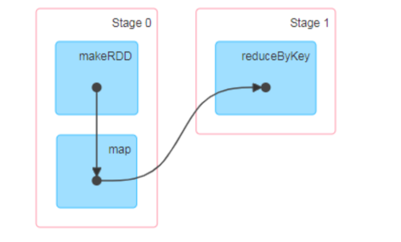

# spark运行框架   
#### 运行架构  
Spark框架的核心是一个计算引擎，整体来说，它采用了标准master-slaver的结构。Driver表示master，负责整个集群中的作业调度。Executor则是slave。负责执行任务。
  
#### 核心组件  
Spark 驱动器节点，用于执行Spark任务中的main方法，负责实际代码的执行工作。Driver在Spark作业执行时主要负责： 
1. 将用户程序转化为作业(job)
2. 在Executor之间调度任务
3. 跟踪Executor的执行情况
4. 通过UI展示查询运行情况。
#### Executor 
1. 负责运行组成spark 应用的任务，并将结果返回给驱动进程。
2. 通过自身的块管理器为用户程序中要哦求缓存的RDD提供内存式存储。RDD是直接缓存在Executor进程内的，因此任务可以在运行时充分利用缓存数据加速运算。  
#### Master&Worker 
spark集群的独立部署环境中，不需要依赖其他的资源调度框架，自身就实现了资源调度的功能，所以环境中还有其他两个核心组件，Master和Worker，这里的Master是一个进程，主要负责资源的调度和分配，并进行集权的监控等职责，类似于Yarn环境中的RM，一个Worker运行在集群中的一台服务器上，由Master分配资源对数据进行并行的处理和计算，类似于Yarn环境中的NM.
#### ApplicationMaster  
Hadoop用户向Yarn集群提交应用程序时，提交程序中应该包含ApplicationMaster，用于向资源调度器申请执行任务的资源容器Container，运行用户自己的程序任务Job,加农整个任务的执行，跟踪整个任务的状态，处理任务失败等异常情况。
## 核心概念
### Executor与Core
  Spark Executor是集群中运行在工作节点(Worker)中的一个JVM进程，是整个集群中的专门用与计算的节点。在提交应用中，可以提供餐无数指定计算节点的个数，以及对应的资源。这里的资源一般指的是工作节点Executor的内存大小和使用的虚拟CPU和数量。
    
### 并行度    
在分布式计算框架中一般都是指多个任务同时执行，由于任务分布在不同的计算节点进行计算，所以能够真正的实现多任务并行执行。
### 有向无环图(DAG)
  
由spark程序直接映射成的数据流的高级抽象模型，简单理解就是将整个程序计算的执行过程用图形表示出来，这样更直观，更便于立=理解，可以用于表示程序的拓扑结构。
DAG有向无环图是由点和线组成的拓扑图形，该图形具有方向，不会闭环。
### 提交流程
所谓的提交流程，其实就是我们开发人员根据需求写的应用程序通过spark客户端提交给spark运行环境执行计算的流程。
  
Spark 应用程序提交到Yarn 环境中执行的时候，一般会有两种部署执行的方式：Client 和Cluster。两种模式主要区别在于：Driver 程序的运行节点位置。  
### YarnClient模式  
Client模式用于监控和调度的Driver模块在客户端执行，而不是在Yarn中，所以一般用于测试。