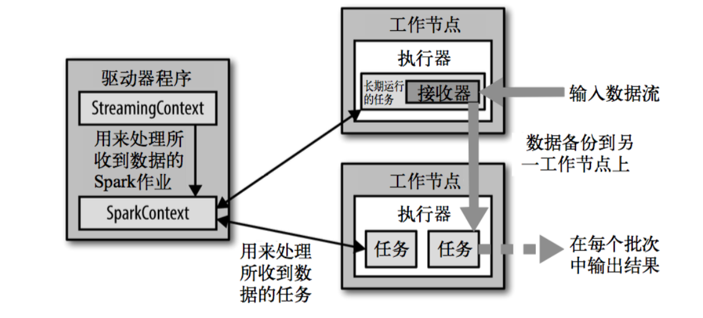

## sparkStreaming  
### 概述  
Spark Streaming 用于流式数据的处理。Spark Streaming 支持的数据输入源很多，例如：Kafka、 Flume、Twitter、ZeroMQ 和简单的 TCP 套接字等等。数据输入后可以用 Spark 的高度抽象原语
如：map、reduce、join、window 等进行运算。而结果也能保存在很多地方，如HDFS，数据库等。
  
和 Spark 基于 RDD 的概念很相似，Spark Streaming 使用离散化流(discretized stream)作为抽 象表示，叫作DStream。DStream 是随时间推移而收到的数据的序列。在内部，每个时间区间收 到的数据都作为 RDD 存在，而DStream是由这些RDD所组成的序列(因此得名“离散化”)。所以
简单来将，DStream 就是对 RDD在实时数据处理场景的一种封装。  
### 特点  
1. 易用
2. 容错 
3. 易整合到spark  
### 架构  
  
  
### 背压机制  
Spark 1.5 以前版本，用户如果要限制Receiver 的数据接收速率，可以通过设置静态配制参 数“spark.streaming.receiver.maxRate”的值来实现，此举虽然可以通过限制接收速率，来适配当前 的处理能力，防止内存溢出，但也会引入其它问题。比如：producer 数据生产高于maxRate，当 前集群处理能力也高于maxRate，这就会造成资源利用率下降等问题。 为了更好的协调数据接收速率与资源处理能力，1.5 版本开始 Spark Streaming 可以动态控制
数据接收速率来适配集群数据处理能力。背压机制（即 Spark Streaming Backpressure）: 根据 JobScheduler 反馈作业的执行信息来动态调整Receiver 数据接收率。 通过属性“spark.streaming.backpressure.enabled”来控制是否启用 backpressure 机制，默认值
false，即不启用。   
##  DStream创建  
测试过程中，可以通过使用 ssc.queueStream(queueOfRDDs)来创建DStream，每一个推送到 这个队列中的RDD，都会作为一个DStream处理。  
#### 自定义数据源
需要继承Receiver，并实现 onStart、onStop 方法来自定义数据源采集。
#### DStream转换  
DStream上的操作与 RDD的类似，分为 Transformations（转换）和Output Operations（输 出）两种，此外转换操作中还有一些比较特殊的原语，如：updateStateByKey()、transform()以及
各种Window相关的原语。
#### 无状态转化操作  
  
需要记住的是，尽管这些函数看起来像作用在整个流上一样，但事实上每个DStream在内部 是由许多RDD（批次）组成，且无状态转化操作是分别应用到每个RDD上的。
例如：reduceByKey()会归约每个时间区间中的数据，但不会归约不同区间之间的数据。  
### TransForm
Transform允许DStream 上执行任意的RDD-to-RDD函数。即使这些函数并没有在DStream 的API 中暴露出来，通过该函数可以方便的扩展 Spark API。该函数每一批次调度一次。其实也
就是对DStream 中的RDD应用转换。  
#### join 
两个流之间的 join 需要两个流的批次大小一致，这样才能做到同时触发计算。计算过程就是 对当前批次的两个流中各自的RDD进行 join，与两个RDD的 join 效果相同。  
### 有状态转化操作  
#### updateStateByKey
UpdateStateByKey 原语用于记录历史记录，有时，我们需要在DStream 中跨批次维护状态(例 如流计算中累加wordcount)。针对这种情况，updateStateByKey()为我们提供了对一个状态变量 的访问，用于键值对形式的DStream。给定一个由(键，事件)对构成的 DStream，并传递一个指 定如何根据新的事件更新每个键对应状态的函数，它可以构建出一个新的 DStream，其内部数
据为(键，状态) 对。updateStateByKey() 的结果会是一个新的DStream，其内部的RDD 序列是由每个时间区间对 应的(键，状态)对组成的。  
updateStateByKey() 的结果会是一个新的DStream，其内部的RDD 序列是由每个时间区间对 应的(键，状态)对组成的。  
updateStateByKey 操作使得我们可以在用新信息进行更新时保持任意的状态。为使用这个功 能，需要做下面两步：
1. 定义状态，状态可以是一个任意的数据类型 
2. 定义状态更新函数，用此函数阐明如何使用之前的状态和来自输入流的新值对状态进行更新。  
3. 使用 updateStateByKey 需要对检查点目录进行配置，会使用检查点来保存状态。  
#### WindowOperations  
Window Operations 可以设置窗口的大小和滑动窗口的间隔来动态的获取当前 Steaming 的允许 状态。所有基于窗口的操作都需要两个参数，分别为窗口时长以及滑动步长。  
1. 窗口时长：计算内容的时间范围;
2. 滑动步长：隔多久触发一次计算。
注意：这两者都必须为采集周期大小的整数倍。
关于Window的操作还有如下方法:
   1) window:基于对DStream窗化的批次进行计算返回一个新的DStream;
   2) countByWindow(windowLength,slideInterval):通过自定义函数整合滑动区间流元素来创建一个新的单元素流动。
   3) reduceByWindow(func, windowLength, slideInterval): 通过使用自定义函数整合滑动区间 流元素来创建一个新的单元素流；
   4) reduceByKeyAndWindow(func, windowLength, slideInterval, [numTasks]): 当在一个(K,V) 对的DStream上调用此函数，会返回一个新(K,V)对的DStream，此处通过对滑动窗口中批次数
      据使用 reduce 函数来整合每个 key 的 value 值。  
   5) reduceByKeyAndWindow(func, invFunc, windowLength, slideInterval, [numTasks]): 这个函 数是上述函数的变化版本，每个窗口的 reduce 值都是通过用前一个窗的 reduce 值来递增计算。 通过 reduce 进入到滑动窗口数据并”反向 reduce”离开窗口的旧数据来实现这个操作。一个例
      子是随着窗口滑动对 keys 的“加”“减”计数。通过前边介绍可以想到，这个函数只适用于”可逆的 reduce 函数”，也就是这些 reduce 函数有相应的”反 reduce”函数(以参数 invFunc 形式 传入)。如前述函数，reduce 任务的数量通过可选参数来配置。  
  
countByWindow()和 countByValueAndWindow()作为对数据进行计数操作的简写。 countByWindow()返回一个表示每个窗口中元素个数的DStream，而 countByValueAndWindow()
返回的DStream 则包含窗口中每个值的个数。  
### DStream输出  
输出操作指定了对流数据经转化操作得到的数据所要执行的操作(例如把结果推入外部数据库 或输出到屏幕上)。与RDD中的惰性求值类似，如果一个DStream 及其派生出的DStream都没 有被执行输出操作，那么这些DStream就都不会被求值。如果 StreamingContext 中没有设定输出
操作，整个 context 就都不会启动。  
   输出操作如下：
1) print()：在运行流程序的驱动结点上打印DStream 中每一批次数据的最开始 10 个元素。这 用于开发和调试。
2) saveAsTextFiles(prefix, [suffix])：以 text 文件形式存储这个DStream 的内容。每一批次的存 储文件名基于参数中的 prefix 和 suffix。”prefix-Time_IN_MS[.suffix]”。
3) saveAsObjectFiles(prefix, [suffix])：以 Java 对象序列化的方式将 Stream 中的数据保存为 SequenceFiles . 每一批次的存储文件名基于参数中的为"prefix-TIME_IN_MS[.suffix]". Python
   中目前不可用。
4) saveAsHadoopFiles(prefix, [suffix])：将 Stream 中的数据保存为 Hadoop files. 每一批次的存 储文件名基于参数中的为"prefix-TIME_IN_MS[.suffix]"。Python API 中目前不可用。
5) foreachRDD(func)：这是最通用的输出操作，即将函数 func 用于产生于 stream的每一个 RDD。其中参数传入的函数 func 应该实现将每一个RDD中数据推送到外部系统，如将
   RDD存入文件或者通过网络将其写入数据库。  
   通用的输出操作 foreachRDD()，它用来对DStream 中的RDD运行任意计算。这和 transform() 有些类似，都可以让我们访问任意RDD。在 foreachRDD()中，可以重用我们在 Spark 中实现的
   所有行动操作。比如，常见的用例之一是把数据写到诸如 MySQL 的外部数据库中。  
注意：  
   1. 连接不能写在 driver 层面（序列化）
   2. 如果写在 foreach 则每个 RDD中的每一条数据都创建，得不偿失；
   3. 增加 foreachPartition，在分区创建（获取）。
### 关闭  
 流式任务需要 7*24 小时执行，但是有时涉及到升级代码需要主动停止程序，但是分布式程序，没办法做到一个个进程去杀死，所有配置优雅的关闭就显得至关重要了。
使用外部文件系统来控制内部程序关闭。

