## spark内核概述  
Spark 内核泛指 Spark 的核心运行机制，包括 Spark 核心组件的运行机制、Spark 任务调 度机制、Spark 内存管理机制、Spark 核心功能的运行原理等，熟练掌握 Spark 内核原理，能 够帮助我们更好地完成 Spark 代码设计，并能够帮助我们准确锁定项目运行过程中出现的问题。  
### Spark核心组件 
#### Driver 
Spark 驱动器节点，用于执行 Spark 任务中的 main 方法，负责实际代码的执行工作。 Driver 在 Spark 作业执行时主要负责：  
1. 将用户程序转化为作业(Job)
2. 在Executor之间调度任务(Task)
3. 跟踪Executor的执行情况
4. 通过UI展示查询运行情况
#### Executor
Spark Executor 对象是负责在 Spark 作业中运行具体任务，任务彼此之间相互独立。Spark 应用启动时，ExecutorBackend 节点被同时启动，并且始终伴随着整个 Spark 应用的生命周 期而存在。如果有 ExecutorBackend 节点发生了故障或崩溃，Spark 应用也可以继续执行，
会将出错节点上的任务调度到其他 Executor 节点上继续运行。  
Executor有两个核心功能:  
1. 负责运行组成Spark应用的任务，并将结果返回给驱动器(Driver)
2. 它们通过自身的块管理器（Block Manager）为用户程序中要求缓存的 RDD 提供内存 式存储。RDD 是直接缓存在 Executor 进程内的，因此任务可以在运行时充分利用缓存
   数据加速运算。

### Spark通用运行流程概述  
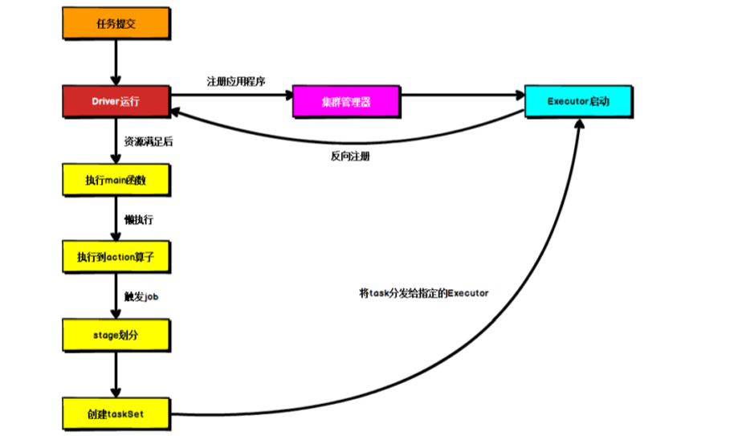  
核心步骤如下:  
1. 任务提交后，都会先启动Driver程序;
2. 随后Driver向集群管理器注册应用程序。
3. 之后管理器根据此任务的配置文件分配Executor并启动程序。
4. Driver开始执行main函数，Spark查询为懒执行，当执行到Action算子时，开始反向推算，根据宽依赖进行stage的划分，随后每一个Stage对应一个TaskSet，TaskSet中有多个Task，查找可用资源Executor进行调度。
5. 根据本地化原则，Task 会被分发到指定的 Executor 去执行，在任务执行的过程中， Executor 也会不断与Driver 进行通信，报告任务运行情况。  
### Spark 部署模式  
Spark 支持多种集群管理器（Cluster Manager），分别为：
1. Standalone：独立模式，Spark 原生的简单集群管理器，自带完整的服务，可单独部署到 一个集群中，无需依赖任何其他资源管理系统，使用 Standalone 可以很方便地搭建一个
集群;
2. Hadoop YARN：统一的资源管理机制，在上面可以运行多套计算框架，如 MR、Storm 等。根据Driver 在集群中的位置不同，分为 yarn client（集群外）和 yarn cluster（集群
   内部）
3. Apache Mesos：一个强大的分布式资源管理框架，它允许多种不同的框架部署在其上， 包括Yarn。
4. K8S : 容器式部署环境。
### YARN模式运行机制
#### YARN Cluster 模式
1. 执行脚本提交任务，实际上是启动一个SparkSubmit的JVM进程。
2. SparkSubmit 类中的main 方法反射调用YarnClusterApplication 的main 方法;
3. YarnClusterApplication 创建 Yarn 客户端，然后向 Yarn 服务器发送执行指令：bin/java ApplicationMaster;
4. Yarn 框架收到指令后会在指定的NM中启动ApplicationMaster;
5. ApplicationMaster 启动Driver 线程，执行用户的作业;
6. AM向RM注册，申请资源;
7. 获取资源后AM向NM发送指令：bin/java YarnCoarseGrainedExecutorBackend;
8. CoarseGrainedExecutorBackend 进程会接收消息，跟 Driver 通信，注册已经启动的 Executor；然后启动计算对象 Executor 等待接收任务。
9. Driver线程继续执行完成作业的调度和任务的执行。
10. Driver分配任务并监控任务的执行。  

 注意：SparkSubmit、ApplicationMaster和CoarseGrainedExecutorBackend是独立的进程；Driver 是独立的线程；Executor 和YarnClusterApplication 是对象。  
 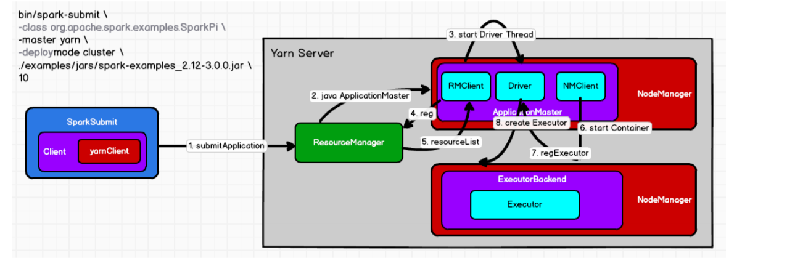  
 #### YARN Client模式  
1. 执行脚本提交任务，实际是提交一个SparkSubmit的Jvm进程。
2. SparkSubmit 类中的main方法 反射调用用户代码的main方法。
3. 启动Dirver线程,执行用户作业，并创建ScheduleBakend;
4. YarnClientSchedulerBackend 向RM发送指令：bin/java ExecutorLauncher;
5. Yarn 框架收到指令后会在指定的 NM 中启动 ExecutorLauncher（实际上还是调用 ApplicationMaster 的main 方法）；  
```scala
object ExecutorLauncher{
   def main (args:Array[String]) :Unit={
      ApplicationMaster.main(args)
   }
}
```  
6. AM向RM注册，申请资源；
7. 获取资源后AM向NM发送指令：bin/java CoarseGrainedExecutorBackend；
8. CoarseGrainedExecutorBackend 进程会接收消息，跟 Driver 通信，注册已经启动的 Executor；然后启动计算对象 Executor 等待接收任务
9. Driver 分配任务并监控任务的执行。    

   注意：SparkSubmit、ApplicationMaster 和YarnCoarseGrainedExecutorBackend 是独立的进 程；Executor 和Driver是对象。  
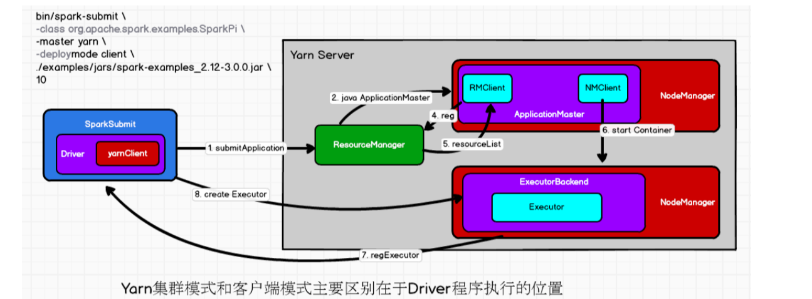  
#### Standalone  
Standalone 集群有 2 个重要组成部分，分别是：  
1) Master(RM)：是一个进程，主要负责资源的调度和分配，并进行集群的监控等职责；
2) Worker(NM)：是一个进程，一个Worker 运行在集群中的一台服务器上，主要负责两个 职责，一个是用自己的内存存储 RDD 的某个或某些 partition；另一个是启动其他进程
   和线程（Executor），对RDD上的 partition 进行并行的处理和计算。  
#### Standalone Cluster 模式 
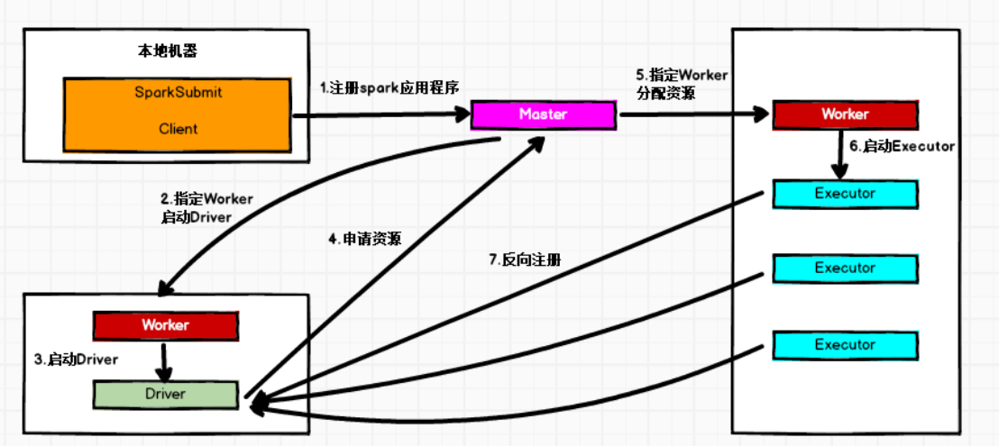  
在 Standalone Cluster 模式下，任务提交后，Master 会找到一个 Worker 启动 Driver。    
Driver 启动后向 Master 注册应用程序，Master 根据 submit 脚本的资源需求找到内部资源至 少可以启动一个 Executor 的所有Worker，然后在这些Worker 之间分配 Executor，Worker 上 的 Executor 启动后会向Driver 反向注册，所有的 Executor 注册完成后，Driver 开始执行main
函数，之后执行到Action 算子时，开始划分 Stage，每个 Stage 生成对应的 taskSet，之后将Task 分发到各个 Executor 上执行。  
#### Standalone Client 模式    
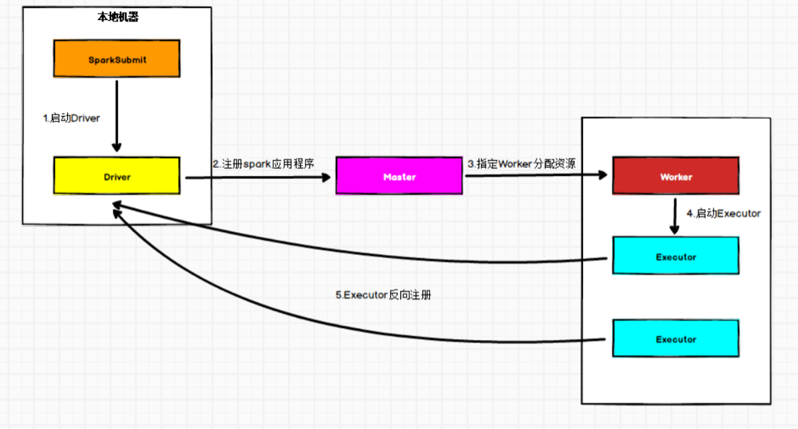  
在 Standalone Client 模式下，Driver 在任务提交的本地机器上运行。Driver 启动后向 Master 注册应用程序，Master 根据 submit 脚本的资源需求找到内部资源至少可以启动一个 Executor 的所有Worker，然后在这些Worker 之间分配 Executor，Worker 上的 Executor 启动 后会向Driver 反向注册，所有的 Executor 注册完成后，Driver 开始执行main 函数，之后执 行到 Action 算子时，开始划分 Stage，每个 Stage 生成对应的 TaskSet，之后将 Task 分发到
各个 Executor 上执行。  
### spark通讯架构  
#### Spark架构概述  
spark中通讯架构的发展: 
1. 在 Standalone Client 模式下，Driver 在任务提交的本地机器上运行。Driver 启动后向 Master 注册应用程序，Master 根据 submit 脚本的资源需求找到内部资源至少可以启动一个 Executor 的所有Worker，然后在这些Worker 之间分配 Executor，Worker 上的 Executor 启动 后会向Driver 反向注册，所有的 Executor 注册完成后，Driver 开始执行main 函数，之后执 行到 Action 算子时，开始划分 Stage，每个 Stage 生成对应的 TaskSet，之后将 Task 分发到
   各个 Executor 上执行。
2. Spark1.3 中引入Netty 通信框架，为了解决 Shuffle 的大数据传输问题使用
3. Spark1.6 中Akka 和Netty 可以配置使用。Netty 完全实现了Akka 在 Spark 中的功能。
4. Spark2 系列中，Spark 抛弃Akka，使用Netty。
   Spark2.x 版本使用Netty 通讯框架作为内部通讯组件。Spark 基于Netty 新的 RPC 框架 借鉴了Akka 的中的设计，它是基于Actor 模型，Spark2.x 版本使用Netty 通讯框架作为内部通讯组件。Spark 基于Netty 新的 RPC 框架 借鉴了Akka 的中的设计，它是基于Actor 模型，
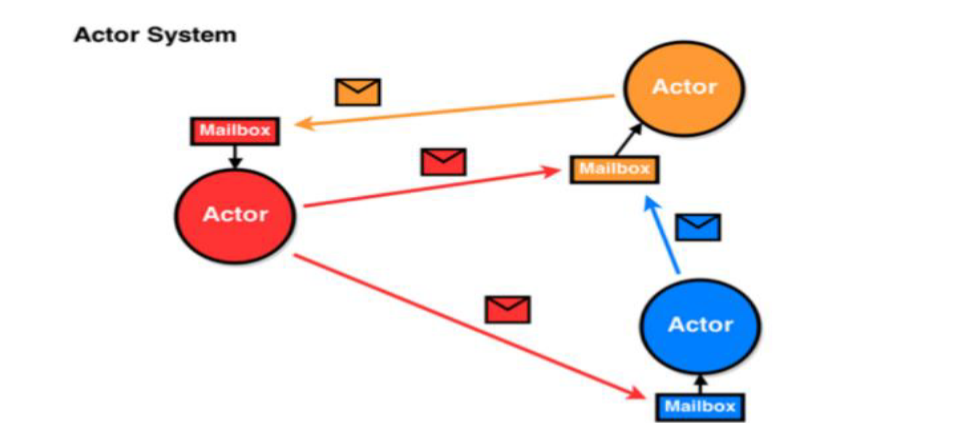  
Spark 通讯框架中各个组件（Client/Master/Worker）可以认为是一个个独立的实体，各 个实体之间通过消息来进行通信。具体各个组件之间的关系图如下：  
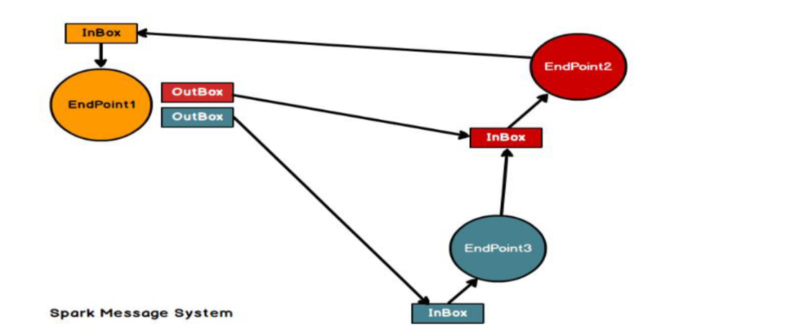  
   Endpoint（Client/Master/Worker）有 1 个 InBox 和N个OutBox（N>=1，N取决于当前 Endpoint 与多少其他的Endpoint进行通信，一个与其通讯的其他Endpoint对应一个OutBox），Endpoint 接收到的消息被写入 InBox，发送出去的消息写入OutBox并被发送到其他Endpoint的 InBox
   中。  
### Spark 通讯架构解析 
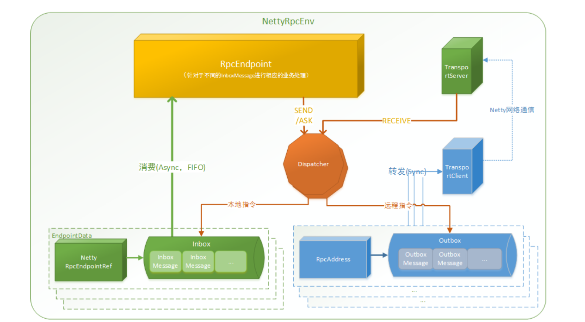  
1. RpcEndPoint:Spark 针对每个节点（Client/Master/Worker）都称之为一 个 RPC 终端，且都实现 RpcEndpoint 接口，内部根据不同端点的需求，设计不同的消 息和不同的业务处理，如果需要发送（询问）则调用 Dispatcher。在 Spark 中，所有的
   终端都存在生命周期。
2. RpcEnv：RPC 上下文环境，每个 RPC 终端运行时依赖的上下文环境称为 RpcEnv；在 把当前 Spark 版本中使用的NettyRpcEnv。
3. Dispatcher：消息调度（分发）器，针对于RPC 终端需要发送远程消息或者从远程RPC 接收到的消息，分发至对应的指令收件箱（发件箱）。如果指令接收方是自己则存入收
   件箱，如果指令接收方不是自己，则放入发件箱；
4. Inbox：指令消息收件箱。一个本地RpcEndpoint 对应一个收件箱，Dispatcher 在每次向 Inbox 存入消息时，都将对应 EndpointData 加入内部ReceiverQueue 中，另外Dispatcher
   创建时会启动一个单独线程进行轮询ReceiverQueue，进行收件箱消息消费；
5. RpcEndpointRef：RpcEndpointRef是对远程 RpcEndpoint 的一个引用。当我们需要向一 个具体的RpcEndpoint 发送消息时，一般我们需要获取到该RpcEndpoint 的引用，然后
   通过该应用发送消息。
6. OutBox：指令消息发件箱。对于当前RpcEndpoint 来说，一个目标RpcEndpoint 对应一 个发件箱，如果向多个目标RpcEndpoint发送信息，则有多个OutBox。当消息放入Outbox 后，紧接着通过TransportClient 将消息发送出去。消息放入发件箱以及发送过程是在同
   一个线程中进行；
7. RpcAddress：表示远程的RpcEndpointRef的地址，Host + Port。
8. TransportClient：Netty通信客户端，一个OutBox对应一个TransportClient，TransportClient 不断轮询OutBox，根据OutBox 消息的 receiver 信息，请求对应的远程 TransportServer；

### 第四章 Spark任务调度器  
 在生产环境下，Spark 集群的部署方式一般为YARN-Cluster 模式，之后的内核分析内容 中我们默认集群的部署方式为 YARN-Cluster 模式。  
Driver 线程 主要是初始化 SparkContext 对象，准备运行所需的上下文，然后一方面保持与 ApplicationMaster 的 RPC 连接，通过 ApplicationMaster 申请资源，另一方面根据用户业务
逻辑开始调度任务，将任务下发到已有的空闲 Executor 上。  
 当ResourceManager向ApplicationMaster返回Container资源时，ApplicationMaster就尝试在对应的Container上启动Executor进程，Executor进程起来后，会向Driver反向注册，注册成功后保持与Driver的心跳，同时等待Driver分发任务，当分发的任务执行完毕后，将任务状态上报给Driver。
#### Spark任务调度概述  
当 Driver 起来后，Driver 则会根据用户程序逻辑准备任务，并根据 Executor 资源情况 逐步分发任务。在详细阐述任务调度前，首先说明下 Spark 里的几个概念。一个 Spark 应用
程序包括 Job、Stage 以及 Task 三个概念：
1. Job 是以Action方法为界，遇到一个Action方法触发一个Job。
2. stage是JOB的子集,以RDD宽依赖为界，遇到Shuffle做一次划分。
3. Task 是 Stage 的子集，以并行度(分区数)来衡量，分区数是多少，则有多少个 task。
   park 的任务调度总体来说分两路进行，一路是 Stage 级的调度，一路是 Task 级的调度，总 体调度流程如下图所示  
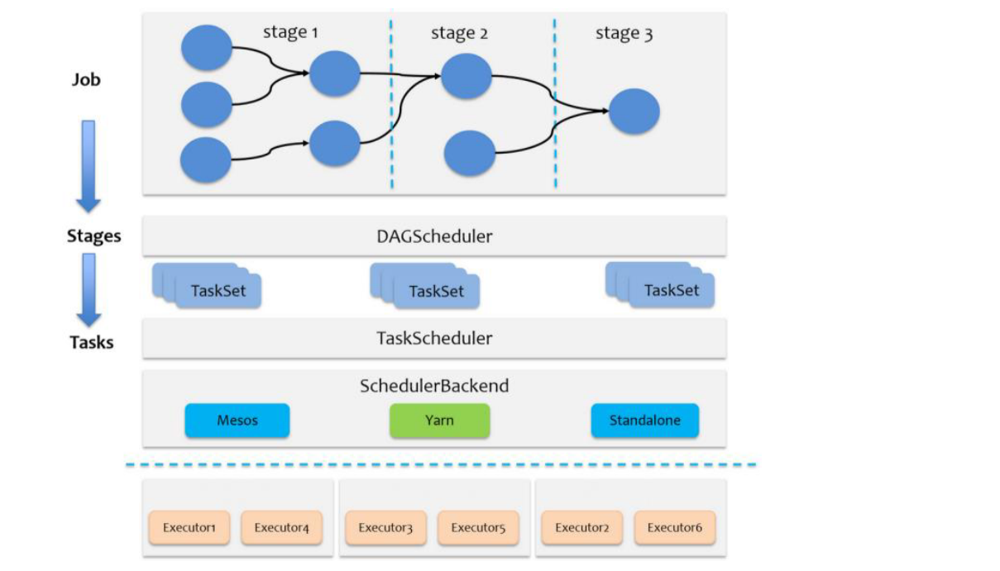  
   Spark RDD通过其Transactions 操作，形成了RDD血缘（依赖）关系图，即DAG，最 后通过Action 的调用，触发 Job 并调度执行，执行过程中会创建两个调度器：DAGScheduler
   和 TaskScheduler。
   1. DAGScheduler 负责Stage级别调度，主要是讲Job切分成若干Stages，并将每个Stage打包成TaskSet交给TaskScheduler调度。
   2. TaskScheduler负责Task级别的调度，将DAGScheduler给过来的TaskSet按照指定的调度策略分发到Executor执行,调度过程中SchedulerBackend负责提供可用资源，其中SchedulerBackend有多种实现，分别对接不同的资源管理系统。
   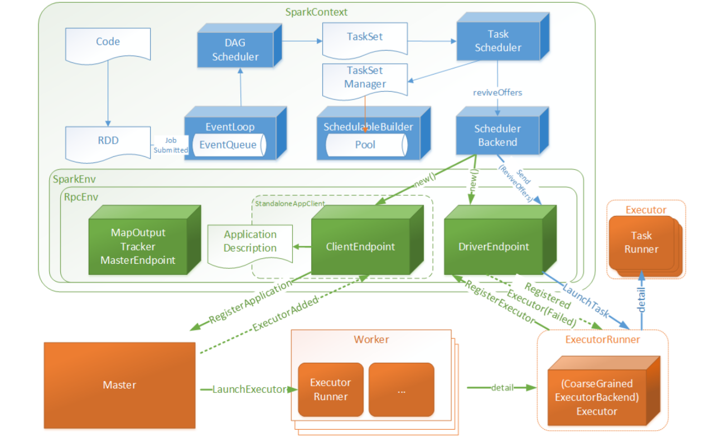
      river 初始化 SparkContext 过程中，会分别初始化 DAGScheduler、TaskScheduler、 SchedulerBackend 以及HeartbeatReceiver，并启动 SchedulerBackend 以及HeartbeatReceiver。 SchedulerBackend 通过 ApplicationMaster 申请资源，并不断从 TaskScheduler 中拿到合适的 Task 分发到 Executor 执行。HeartbeatReceiver 负责接收 Executor 的心跳信息，监控 Executor
      的存活状况，并通知到TaskScheduler。  
#### Spark Stage 级别调度 
Spark 的任务调度是从 DAG 切割开始，主要是由 DAGScheduler 来完成。当遇到一个 Action 操作后就会触发一个 Job 的计算，并交给 DAGScheduler 来提交，下图是涉及到 Job
提交的相关方法调用流程图。  
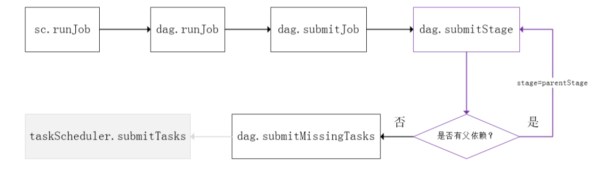  
1) Job 由最终的RDD和Action 方法封装而成；
2) SparkContext 将 Job 交给 DAGScheduler 提交，它会根据 RDD 的血缘关系构成的 DAG 进行切分，将一个 Job 划分为若干 Stages，具体划分策略是，由最终的 RDD 不断通过 依赖回溯判断父依赖是否是宽依赖，即以 Shuffle 为界，划分 Stage，窄依赖的 RDD之 间被划分到同一个 Stage 中，可以进行 pipeline 式的计算。划分的 Stages 分两类，一类 叫做 ResultStage，为 DAG 最下游的 Stage，由 Action 方法决定，另一类叫做
   ShuffleMapStage，为下游 Stage 准备数据。
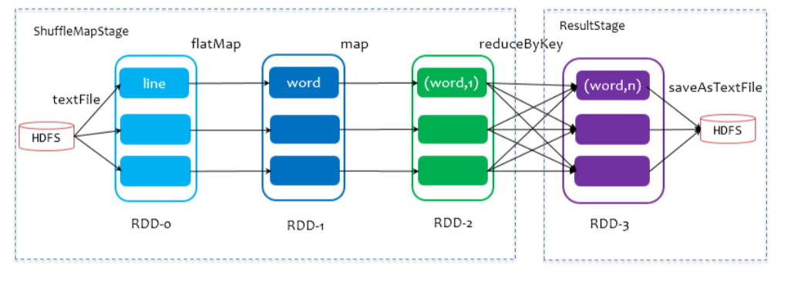  
   Job 由 saveAsTextFile 触发，该 Job 由RDD-3 和 saveAsTextFile 方法组成，根据 RDD之 间的依赖关系从RDD-3 开始回溯搜索，直到没有依赖的RDD-0，在回溯搜索过程中，RDD3 依赖RDD-2，并且是宽依赖，所以在RDD-2 和 RDD-3 之间划分 Stage，RDD-3 被划到最 后一个 Stage，即ResultStage 中，RDD-2 依赖RDD-1，RDD-1 依赖RDD-0，这些依赖都是 窄依赖，所以将 RDD-0、RDD-1 和 RDD-2 划分到同一个 Stage，形成 pipeline 操作，。即 ShuffleMapStage 中，实际执行的时候，数据记录会一气呵成地执行 RDD-0 到 RDD-2 的转
   化。不难看出，其本质上是一个深度优先搜索（Depth First Search）算法。    
   一个 Stage 是否被提交，需要判断它的父 Stage 是否执行，只有在父 Stage 执行完毕才 能提交当前 Stage，如果一个 Stage 没有父 Stage，那么从该 Stage 开始提交。Stage 提交时会
   将 Task 信息（分区信息以及方法等）序列化并被打包成 TaskSet 交给 TaskScheduler，一个Partition 对应一个 Task，另一方面 TaskScheduler 会监控 Stage 的运行状态，只有 Executor 丢 失或者 Task 由于 Fetch 失败才需要重新提交失败的 Stage 以调度运行失败的任务，其他类型
   的 Task 失败会在TaskScheduler 的调度过程中重试。  
   相对来说 DAGScheduler 做的事情较为简单，仅仅是在 Stage 层面上划分 DAG，提交 Stage 并监控相关状态信息。  
### SparkTask级调度    
Spark Task 的调度是由 TaskScheduler 来完成，由前文可知，DAGScheduler 将 Stage 打 包到交给 TaskScheTaskSetduler，TaskScheduler 会将 TaskSet 封装为 TaskSetManager 加入到
调度队列中，TaskSetManager 结构如下图所示。  
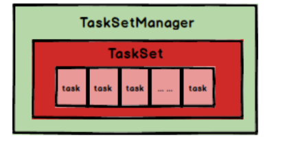  
TaskSetManager 负责监控管理同一个Stage中的Tasks,TasksScheduler就是以TaskSetManager为单元来调度任务。TaskScheduler 初始化后会启动 SchedulerBackend，它负责跟外界打交道， 接收 Executor 的注册信息，并维护 Executor 的状态，同时它在启动后会定期地去“询问”TaskScheduler 有没有任务要运行,  
会从调度队列中按照指定的调度策略选择 TaskSetManager 去调度运行，大致方 法调用流程如下图所示：  
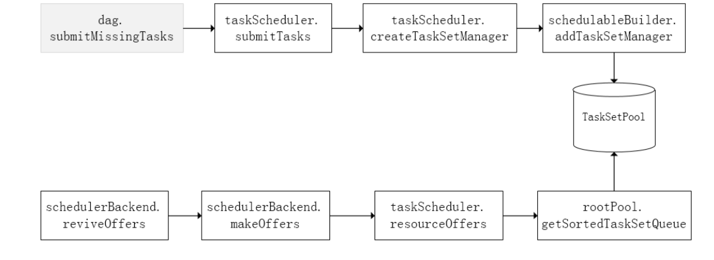  
上图中，将 TaskSetManager 加入 rootPool 调度池中之后，调用 SchedulerBackend 的 riviveOffers 方法给 driverEndpoint 发送ReviveOffer 消息；driverEndpoint 收到ReviveOffer消息后调用makeOffers方法，过滤出活跃状态的Excutor(这些 Executor 都是任务启动时反 向注册到 Driver 的 Executor),然后将将Executor封装成为WorkerOffer对象；准备好计算机资源后，taskScheduler基于这些资源调用resourceOffer在Executor上分配task。  
### 调度策略
TaskScheduler支持两种调度策略，一种是FIFO，也是默认的调度策略，另外一种是FAIR，在 TaskScheduler 初始化过程中会实例化 rootPool，表示树的根节点，是 Pool 类型。

1) FIFO调度测略
   如果是采用 FIFO 调度策略，则直接简单地将 TaskSetManager 按照先来先到的方式入 队，出队时直接拿出最先进队的 TaskSetManager，其树结构如下图所示，TaskSetManager 保
   存在一个 FIFO队列中。  
   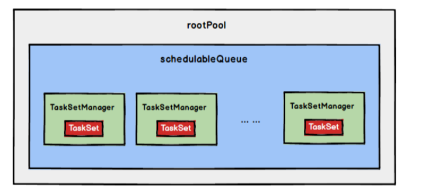
2) FAIR调度策略
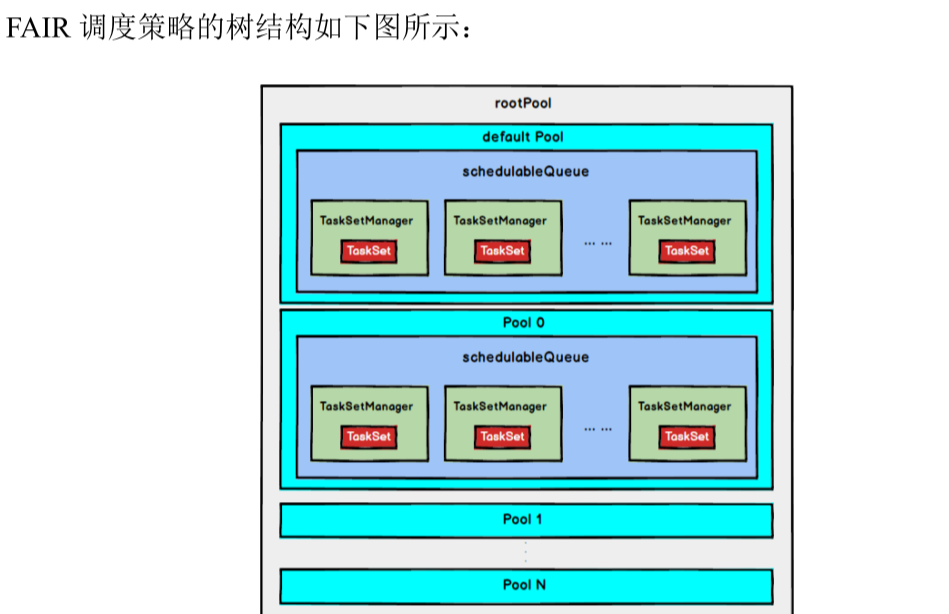
FAIR模式中有一个rootPool和多个子Pool，各个子Pool中存储这所有待分配的TaskSetManager。 在FAIR模式中，需要先对Pool进行排序，再对Pool里面的TaskSetMananger进行排序，因为Pool和TaskSetManager都继承了Schedulable特质，因此使用相同的排序算法。  
排序过程的比较是基于Fair-share来比较的，每个要排序的对象包含三个属性：runningTasks值(正在运行的Task数)，minShare值，weight值，比较时会综合考量runningTasks值，minShare值，以及weight值。 minShare、weight 的值均在公平调度配置文件 fairscheduler.xml 中被指定，调度 池在构建阶段会读取此文件的相关配置。  
   1) 如果A对象的runningTasks大于它的minShare，B对象的runningTasks小于它的minShare， 那么B 排在A前面；（runningTasks 比minShare 小的先执行）
   2) 如果 A、B 对象的 runningTasks 都小于它们的 minShare，那么就比较 runningTasks 与 minShare 的比值（minShare 使用率），谁小谁排前面；（minShare 使用率低的先执行）
   3) 如果 A、B 对象的 runningTasks 都大于它们的 minShare，那么就比较 runningTasks 与 weight 的比值（权重使用率），谁小谁排前面。（权重使用率低的先执行）
   4) 如果上述比较比较均相等，则比较名字。
整体上来说就是通过minShare和weight这两个参数控制比较过程，可以做到让minShare使用率和权重率使少的先运行。
FAIR 模式排序完成后，所有的TaskSetManager被放入一个ArrayBuffer里，之后一次取出并发给Executor。执行。 从调度队列中拿到 TaskSetManager 后，由于 TaskSetManager 封装了一个 Stage 的所有 Task，并负责管理调度这些 Task，那么接下来的工作就是 TaskSetManager 按照一定的规则 一个个取出 Task 给 TaskScheduler，TaskScheduler 再交给 SchedulerBackend 去发到 Executor 上执行。
### 本地化调度
DAGScheduler切割Job,划分Stage，通过调用submitStage来提交一个Stage对应的tasks，submitStage会调用submitMissingTasks，submitMissingTasks确定每个需要计算的tasks的preferredlocations，通过调用getPreferrdelocations()得到partition的优先位置，对于要提交到TaskScheduler的TaskSet中的每一个Task，该Task优先位置与其对应的partition对应的优先位置一致。
从调度队列中拿到TaskSetManager后，TaskSetManager按照一定的规则一个个取出task给TaskScheduler,TaskScheduler再给SchedulerBackend去发到Executor上执行。前面也提到，TaskSetManager封装了一个Stage的所有Task，并负责管理调度这些Task。
 根据每个Task的优先位置，确定Task的Locality级别，Locality一共有五种，优先级由告到低如下：
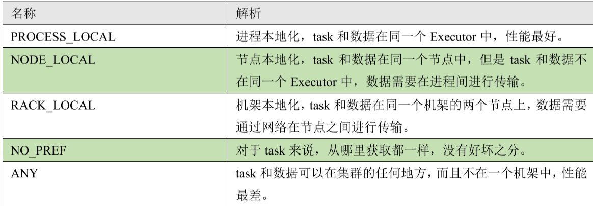  
  在执行调度时，Spark调度总是会尽量让每个task以最高的本地性级别来启动，当一个task以X本地性级别启动，但是本地性级别对应的所有节点都没有空闲资源而启动失败，此时并不会马上降低本地性级别启动而是在某个时间长度内再次以X本地性级别来启动该task，若超过时间限制则降级启动，去尝试下一个本地性级别，以此类推。
 可以通过调大每个类别的自大容忍延迟时间，在等待阶段对应的Executor可能就会有相应的资源去执行此task，这就在一定程度上提高了运行性能。

### 失败重试与黑名单机制  
 除了选择合适的Task调度运行外，还需要监控Task的执行状态。对于失败的 Task，会记录它失败的次数，如果失败次数还没有超过最大 重试次数，那么就把它放回待调度的 Task 池子中，否则整个Application 失败。  
在记录Task失败次数过程中，会记录它上一次失败所在的ExecutorId和Host，这样下次在调度这个Task时，会使用黑名单机制，避免它被调度到上一次失败的节点，起到一定的容错作用。黑名单记录Task上一次失败所在的ExecutorId和Host，以其对应的“拉黑时间”，“拉黑”时间是值这段时间内不要再往这个节点上调度这个Task。
## SparkShuffle 解析  
### Shuffle 的核心要点
#### ShuffleMapStage 与 ResultStage 
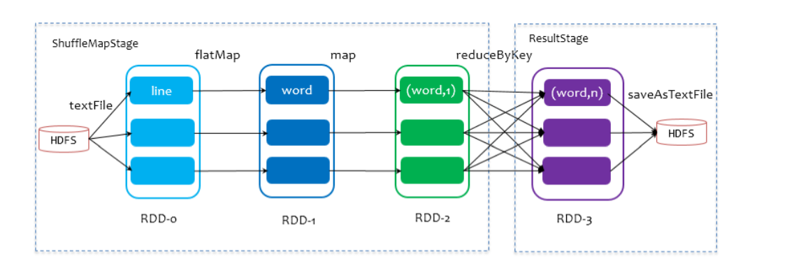  
 在划分stage时，最后一个stage称为finalStage，它本质上是一个ResultStage对象，前面的所有stage被称为ShuffleMapStage。
ShuffleMapStage的结束伴随着shuffle文件的写磁盘。 ResultMapStage基本上对应代码中的action算子，即将一个函数应用在RDD的各个partition的数据集上，意味着一个job
的运行结束。  
### HashShuffle解析  
#### 未优化的HashShuffle 
从 Task 开始那边各自把自己进行 Hash 计算(分区器： hash/numreduce 取模)，分类出 3 个不同的类别，每个 Task 都分成 3 种类别的数据，想把不 同的数据汇聚然后计算出最终的结果，所以Reducer 会在每个 Task 中把属于自己类别的数 据收集过来，汇聚成一个同类别的大集合，每 1 个 Task 输出 3 份本地文件，这里有 4 个
Mapper Tasks，所以总共输出了4个Tasks x 3个分类文件 = 12 个本地小文件。  
#### 优化后的HashShuffle  
优化的 HashShuffle 过程就是启用合并机制，合并机制就是复用 buffer，开启合并机制 的配置是 spark.shuffle.consolidateFiles。该参数默认值为 false，将其设置为 true 即可开启优
化机制。通常来说，如果我们使用HashShuffleManager，那么都建议开启这个选项。  
这里还是有 4 个 Tasks，数据类别还是分成 3 种类型，因为 Hash 算法会根据你的 Key 进行分类，在同一个进程中，无论是有多少过 Task，都会把同样的 Key 放在同一个 Buffer 里，然后把 Buffer 中的数据写入以 Core 数量为单位的本地文件中，(一个 Core 只有一种类 型的Key 的数据)，每 1 个Task 所在的进程中，分别写入共同进程中的 3 份本地文件，这里
有 4 个 Mapper Tasks，所以总共输出是 2 个Cores x 3 个分类文件 = 6 个本地小文件。  
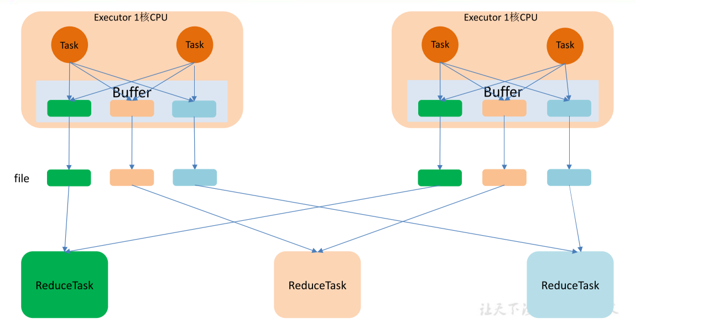  
### SortShuffle 解析  
 在该模式下，数据会先写入一个数据结构，reduceByKey写入Map，一边通过Map局部聚合，一边写入内存。Join算子写入ArrayList直接写入内存中。然后需要判断是否达到阈值，如果达到就会将内存数据结构的数据写入到磁盘，清空内存数据结构。  
在溢写磁盘前，先根据key进行排序，排序过后的数据，会分批写入到磁盘文件中,默认批次为10000条，汇聚会以每批一万条写入到磁盘文件，写入磁盘文件通过缓冲区溢写的方式，每次溢写都会产生一个磁盘文件，也就说一个Task会产生多个临时文件。  
  最后在每个Task中，将所有的临时文件合并，此过程将所有临时文件读取出来，一次写入到最终文件当中。意味着一个Task的所有数据都在这一个文件中。同时单独写一份索引文件，标识下游各个Task的数据在文件中的索引，start offset和 end offset。
 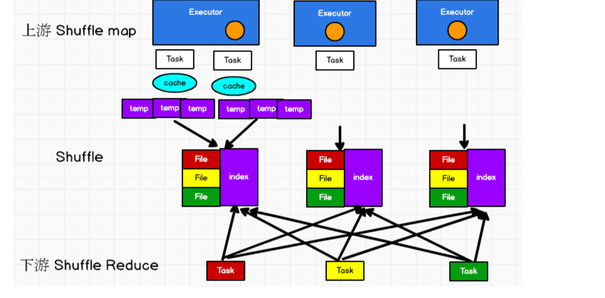  
#### bypass SortShuffle 
bypass 运行机制如下：
1) shuffle reduce task 数量小于等于 spark.shuffle.sort.bypassMergeThreshold 参数的值，默认为200。
2) 不是聚合类的shuffle算子(比如reduceByKey)。
   此时 task 会为每个 reduce 端的 task 都创建一个临时磁盘文件，并将数据按 key 进行 hash 然后根据 key 的 hash 值，将 key 写入对应的磁盘文件之中。当然，写入磁盘文件时也先写入内存缓冲，缓冲写满之后再溢写到磁盘文件的。最后，同样会将所有临时磁盘文件 都合并成一个磁盘文件，并创建一个单独的索引文件。
   该过程的磁盘写机制其实跟未经优化的 HashShuffleManager 是一模一样的，因为都要 创建数量惊人的磁盘文件，只是在最后会做一个磁盘文件的合并而已。因此少量的最终磁盘
   文件，也让该机制相对未经优化的HashShuffleManager 来说，shuffle read 的性能会更好。而该机制与普通 SortShuffleManager 运行机制的不同在于：不会进行排序。也就是说， 启用该机制的最大好处在于，shuffle write 过程中，不需要进行数据的排序操作，也就节省
   掉了这部分的性能开销。  
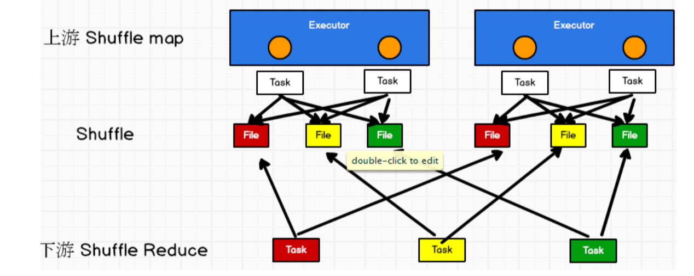  
## Spark内存管理 
### 堆内存和堆外内存规划
作为一个JVM进程，Executor的内存管理建立在Jvm的内存管理之上，Spark对JVM的堆内存(on-heap)空间进行了更为详细的分配，已充分利用内存。同时，Spark引入堆外内存(offset-heap),使之可以直接在工作节点的系统内存中开辟空间，进一步优化了内存的使用。堆内存受到JVM的统一管理，堆外内存是直接向曹做系统进行内存的申请和释放。
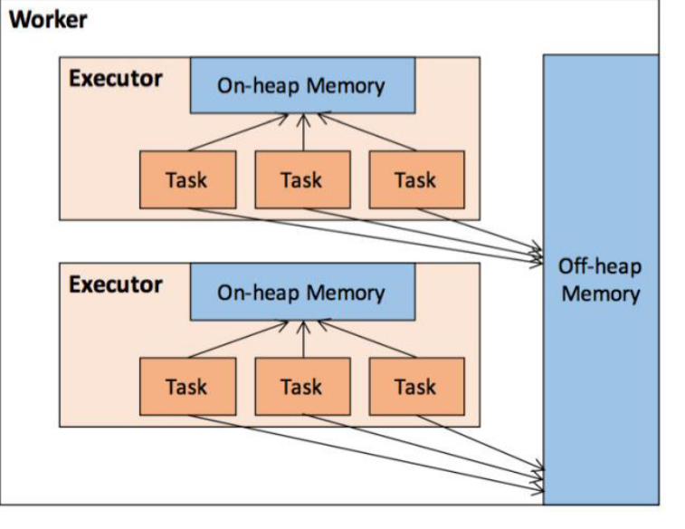  
1) 堆内内存
 堆内内存的大小，由Spark应用程序启动时的 - executor-memory或spark.executor.memory 参数配置。Executor内运行的并发任务共享Jvm堆内内存，这些任务在缓存RDD数据和广播数据时占用的内存被规划为存储内存，而这些任务在执行Shuffle时占用的内存被规划为执行内存，剩余的部分不做特殊规划，那些Spark内部的对象实例，或者用户定义的Spark应用程序的对象实例，均占用剩余的空间。不同的管理模式下，这三部分占用的空间大小各不相同。
 Spark对堆内内存的管理是一种逻辑上的“规划式”管理，因为对象实例占用内存的申请和释放都有JVM完成,Spark只能在申请后和释放前记录这些内存。  
具体流程如下：
   1. Spark在代码中 new一个对象实例；
   2. JVM从堆内内存分配空间，创建对象并返回对象引用。
   3. spark保存该对象的引用，记录该对象占用的内存。  

释放内存流程如下：  
   1. Spark记录该对象释放的内存，删除该对象的引用。
   2. 等待JVM的垃圾回收机制释放该对象占用的堆内内存  

我们知道，JVM 的对象可以以序列化的方式存储，序列化的过程是将对象转换为二进 制字节流，本质上可以理解为将非连续空间的链式存储转化为连续空间或块存储，在访问时 则需要进行序列化的逆过程——反序列化，将字节流转化为对象，序列化的方式可以节省存
储空间，但增加了存储和读取时候的计算开销。对于Spark中序列化的对象，由于是字节流的形式，其占用的内存大小可直接计算，而对于非序列化的对象，其占用的内存是通过周期性地采样近似估算而得，即并不是每次新增地数据项都会计算一次占用地内存大小，这种方法降低了时间开销但是有可能误差较大，导致某一时刻地实际内存有可能远远超出预期。此外，在被Spark标记为释放的对象实例，很可能在实际上并没有被JVM回收，导致实际可用的的内存小于Spark记录的可用内存，
所以Spark并不能准确地记录实际可用的堆内存，从而也就无法完全避免内存溢出的异常。   
虽然不能精准控制堆内内存的申请和释放，但Spark通过对存储内衬和执行内存各自独立的规划管理，可以决定是否要在存储内存里缓存新的RDD,以及是否为新的任务分配执行内存，在一定程度上可以提升内存的利用率，减少异常的出现。
2) 堆外内存  
   为了进一步优化内存的使用及提高,Shuffle 时排序的效率，Spark引入了堆外内存，使之可以直接在工作节点的系统内存中开辟空间，存储经过序列化的二进制数据。  
   堆外内存意味着把内存对象分配在Java虚拟机的堆以外的内存，这些内存直接受操作系统管理，这样做的结果就是能保持一个较小的堆，以减少垃圾收集对应用的影响。利用 JDK Unsafe API（从 Spark 2.0 开始，在管理堆外的存储内存时不再基于Tachyon， 而是与堆外的执行内存一样，基于 JDK Unsafe API 实现）Spark 可以直接操作系统堆外内
   存，减少了不必要的内存开销，以及频繁的 GC 扫描和回收，提升了处理性能。堆外内存可以被精确地申请和释放(堆外内存之所以能够被精确的申请和释放，是由于内存的申请和释放不再通过 JVM机制，而是直接向操作系统申请，JVM对于内存的清理是无法准确指定 时间点的，因此无法实现精确的释放)，而且序列化的数据占用的空间可以被精确计算，
  所以相比堆内内存来说降低了管理的难度，也降低了误差。
 在默认情况下堆外内存并不启用，可通过配置spark.memory.offHeap.enabled 参数启动,并由spark.memory.offHeap.size 参数设定堆外空间的大小。除了没有其他空间，堆外内存与堆内内存的划分方式相同，所有运行运行中的并发任务共享存储内存和执行内存。  
### 内存空间分配  
   1) 静态内存管理
      在Spark最初采用的静态内存管理机制下，存储内存，执行内存和其他内存的大小在Spark应用程序运行期间均为固定的，单用户可以应用程序启动前进行配置，堆内内存的分配如图所示：
     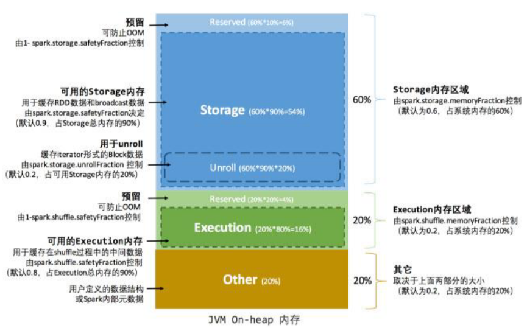  
 可用的堆内内存的大小需要按照下列方式计算：
   ```text
    可用的内存  = systemMaxMemory * spark.storage.memoryFraction * spark.storage.safety
   ```

   ```text
    Fraction 可用的执行内存 = systemMaxMemory * spark.shuffle.memoryFraction * spark.shuffle.safety
    Fraction
   ```
   其中 systemMaxMemory 取决于当前 JVM 堆内内存的大小，最后可用的执行内存或者存储 内存要在此基础上与各自的memoryFraction 参数和 safetyFraction 参数相乘得出。
   上述计算 公式中的两个 safetyFraction 参数，其意义在于在逻辑上预留出 1-safetyFraction 这么一块 保险区域，降低因实际内存超出当前预设范围而导致 OOM 的风险（上文提到，对于非序
   列化对象的内存采样估算会产生误差）。在具体使用时 Spark 并没有区别对待，和”其它内存”一样交给了JVM去管理。
   Storage内存和Execution内存都有预留空间，目的是防止OOM，因为Spark堆内内存大小的记录是不准确的，需要留出保险区域。堆外的空间分配较为简单，只有存储内存和执行内存，如下图所示。可用的执行内存和存储内存占用的空间大小直接由参数 spark.memory.storageFraction决定，
   由于堆外内存占用的空间可以被精确计算,所以无需在设定保险区域。
   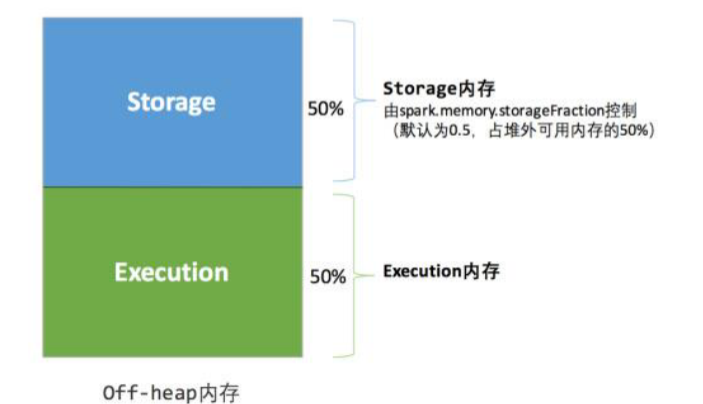
   静态内存管理机制实现起来较为简单，但如果用户不熟悉Spark的存储机制，或没有根据具体的数据规模和计算任务或做相应的配置，很容易造成”一半海水，一半火焰”的局面，即存 储内存和执行内存中的一方剩余大量的空间，而另一方却早早被占满，不得不淘汰或移出旧
   的内容以存储新的内容。由于新的内存管理机制的出现，这种方式目前已经很少有开发者使 用，出于兼容旧版本的应用程序的目的，Spark 仍然保留了它的实现。
   2) 统一内存管理  
      Spark1.6 之后引入的统一内存管理机制，与静态内存管理的区别在于存储内存和执行 内存共享同一块空间，可以动态占用对方的空闲区域，统一内存管理的堆内内存结构如图所
      示：
    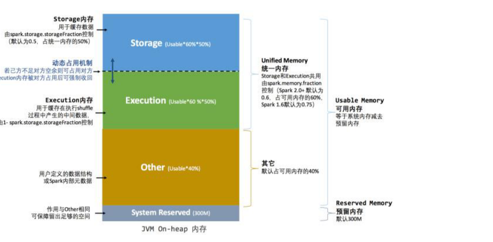
其中最重要的优化在于动态占用机制，其规则如下：
      1. 设定基本的存储内存和执行区域（spark.storage.storageFraction 参数）,该设定确定了双方各自拥有的空间的范围；
      2. 双发的空间都不足时，则存储到硬盘;若己方空间不足而对方空余时，可借用对方的空间;(存储空间不足是指以放下一个完整的Block)
      3. 执行内存的空间被对方占用后，可以让对方将占用的部分转存到硬盘，然后“归还”借用的空间。
      4. 存储内存的空间被对方占用后，无法让对方“归还”,因为需要考虑Shuffle过程中的很多因素，实现起来较为复杂
统一内存管理的动态占用机制如图：
      
凭借统一内存管理机制，Spark在一定程度上提高了堆内存和堆外内存资源的利用率，降低了开发者维护Spark内存的难度，但并不意味着开发者可以高枕无忧，如果存储内存的空间太大或者说缓存的数据过多，反而会导致频繁的全量垃圾回收，降低任务执行时的性能，因为缓存的RDD数据通常都是长期驻留内存的。
### 存储内存管理
##### 1) RDD的持久化机制
  弹性分布式数据集(RDD)作为Spark最根本的数据抽象，是只读的分区记录的集合，只能基于在稳定物理存储中的数据集上创建，或者在其他已有的RDD上执行转换操作产生一个新的RDD。转换后的RDD与原始的RDD之间产生的依赖关系，构成了血统，凭借血统，Spark保证了每一个RDD都可以被重新恢复。但RDD的所有转换都是惰性的，即只有当一个返回结果给Driver的行动发生时，Spark才会创建任务读取RDD，然后真正触发转换的执行。  
  Task在启动之初读取一个分区时，会先判断这个分区是否已经被持久化，如果没有需要检查CheckPoint或按照血统重新计算。如果一个RDD上要执行多次行动，可以在第一次行动中使用persist或cache方法，在内存或磁盘中持久化或缓存这个RDD，从而在后面的行动时提升计算速度。
  事实上，cache方法是使用默认的MEMORY_ONLY的存储级别将RDD持久化到内存，故缓存是一种特殊的持久化。堆内存和堆外存储的设计，便可以对缓存RDD时使用的内存做统一的规划和管理。 
  RDD的持久化由Spark的Storage模块负责，实现RDD与物理存储的解耦合。Storage模块负责管理Spark在计算过程中产生的数据，将那些在内存或磁盘，在本地或远程取数据的功能封装了起来。在具体实现时，Driver端和Executor端的Sotrage模块构成了主从式的架构，即Driver端的BlockManager为Master，Executor端的BlockManager为Slave。
Sotrage模块在逻辑上以Block为基本存储单位,RDD的每个Partition经过处理后唯一对应一个Block（BlockId 的格式为 rdd_RDD-ID_PARTITION-ID ）。Driver端的Master负责震哥哥Spark应用程序的Block的元数据信息的管理与维护和维护，而Executor端的Slave需要将Block的更新等状态上报到Master，同时接收Master的命令，例如新增或删除一个RDD。  
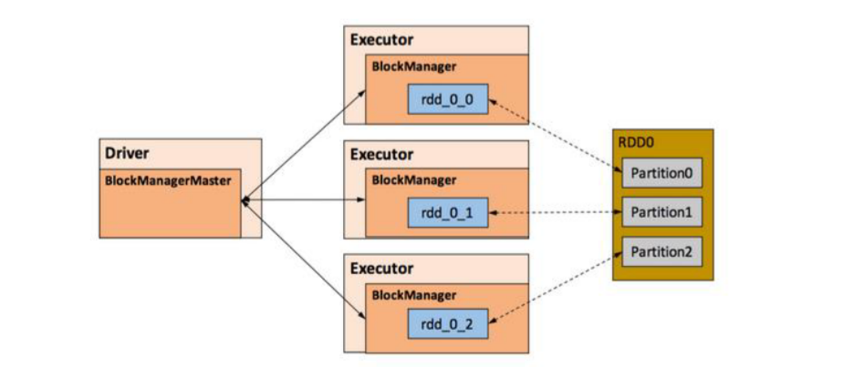  
  在对RDD持久化时，Spark 规定了MEMORY_ONLY、MEMORY_AND_DISK 等 7 种 不同的存储级别，而存储级别是以下 5 个变量的组合：
  ```text
class StorageLevel private( 
private var _useDisk: Boolean, //磁盘 
private var _useMemory: Boolean, //这里其实是指堆内内存 
private var _useOffHeap: Boolean, //堆外内存 
private var _deserialized: Boolean, //是否为非序列化 
private var _replication: Int = 1 //副本个数
)
```  
Spark 中 7 种存储级别如下：  
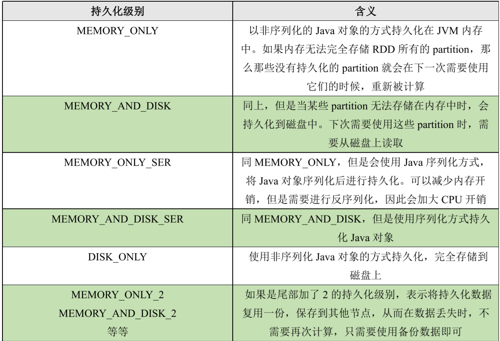  
通过对数据结构的分析，可以看出存储级别从三个维度定义了RDD的 Partition（同时也就 是Block）的存储方式：   
1. 存储位置：磁盘／堆内内存／堆外内存。如 MEMORY_AND_DISK 是同时在磁盘和堆 内内存上存储，实现了冗余备份。OFF_HEAP 则是只在堆外内存存储，目前选择堆外
   内存时不能同时存储到其他位置。
2. 存储形式：Block 缓存到存储内存后，是否为非序列化的形式。如 MEMORY_ONLY 是 非序列化方式存储，OFF_HEAP 是序列化方式存储。
3. 副本数量：大于 1 时需要远程冗余备份到其他节点。如DISK_ONLY_2 需要远程备份 1 个副本。
2) RDD缓存过程
   RDD 在缓存到存储内存之前，Partition 中的数据一般以迭代器（Iterator）的数据结构来访问，这是 Scala 语言中一种遍历数据集合的方法。通过 Iterator 可以获取分区中每一条序 列化或者非序列化的数据项(Record)，这些 Record 的对象实例在逻辑上占用了 JVM 堆内内
   存的 other 部分的空间，同一 Partition 的不同 Record 的存储空间并不连续。RDD 在缓存到存储内存之后，Partition 被转换成 Block，Record 在堆内或堆外存储内存中 占用一块连续的空间。将 Partition 由不连续的存储空间转换为连续存储空间的过程，Spark
   称之为"展开"（Unroll）。  
   Block 有序列化和非序列化两种存储格式，具体以哪种方式取决于该 RDD 的存储级别。非 序列化的Block 以一种 DeserializedMemoryEntry 的数据结构定义，用一个数组存储所有的 对象实例，序列化的 Block 则以 SerializedMemoryEntry 的数据结构定义，用字节缓冲区 （ByteBuffer）来存储二进制数据。每个 Executor 的 Storage 模块用一个链式 Map 结构 （LinkedHashMap）来管理堆内和堆外存储内存中所有的 Block 对象的实例，对这个
   LinkedHashMap 新增和删除间接记录了内存的申请和释放。
   因为不能保证存储空间可以一次容纳 Iterator 中的所有数据，当前的计算任务在 Unroll 时 要向 MemoryManager 申请足够的 Unroll 空间来临时占位，空间不足则 Unroll 失败，空间 足够时可以继续进行。
   对于序列化的 Partition，其所需的Unroll 空间可以直接累加计算，一次申请。
   对于非序列化的 Partition 则要在遍历 Record 的过程中依次申请，即每读取一条 Record， 采样估算其所需的 Unroll 空间并进行申请，空间不足时可以中断，释放已占用的 Unroll 空
   间。如果最终 Unroll 成功，当前 Partition 所占用的 Unroll 空间被转换为正常的缓存 RDD 的存 储空间，如下图所示。
    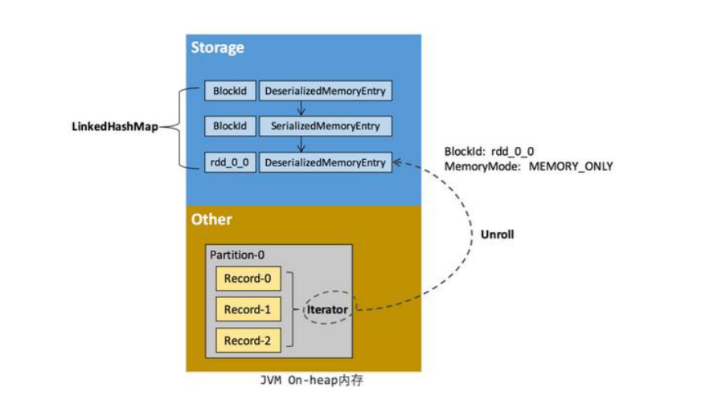  
   在静态内存管理时，Spark 在存储内存中专门划分了一块 Unroll 空间，其大小是固定的，统一内存管理时则没有对 Unroll 空间进行特别区分，当存储空间不足时会根据动态占用机 制进行处理。
3) 淘汰与罗盘  
   由于同一个 Executor 的所有的计算任务共享有限的存储内存空间，当有新的 Block 需 要缓存但是剩余空间不足且无法动态占用时，就要对 LinkedHashMap 中的旧 Block 进行淘 汰（Eviction），而被淘汰的 Block 如果其存储级别中同时包含存储到磁盘的要求，则要对其
   进行落盘（Drop），否则直接删除该Block。  
  存储内存淘汰的规则：
   1. 被淘汰的旧的Block要与新的Block的MemoryMode相同，即同属于堆外或堆内内存。
   2. 新旧Block不能属于同一个RDD，避免循环淘汰。
   3. 旧Block所属RDD不能处于被读状态，避免引发一致性问题；
   4. 遍历 LinkedHashMap 中 Block，按照最近最少使用（LRU）的顺序淘汰，直到满足新 Block 所需的空间。其中LRU 是 LinkedHashMap 的特性。   
落盘的流程则比较简单，如果其存储级别符合_useDisk 为 true 的条件，再根据其_deserialized 判断是否是非序列化的形式，若是则对其进行序列化，最后将数据存储到磁盘，在 Storage 模块中更新其信息。   
#### 执行内存管理  
执行内存主要用来存储任务在执行 Shuffle 时占用的内存，Shuffle 是按照一定规则对 RDD数据重新分区的过程，我们来看 Shuffle 的Write 和Read 两阶段对执行内存的使用：  
1) Shuffle Write   
   若在map 端选择普通的排序方式，会采用 ExternalSorter 进行外排，在内存中存储数据时主 要占用堆内执行空间。
   若在 map 端选择 Tungsten 的排序方式，则采用 ShuffleExternalSorter 直接对以序列化形式 存储的数据排序，在内存中存储数据时可以占用堆外或堆内执行空间，取决于用户是否开启
   了堆外内存以及堆外执行内存是否足够。  
2) Shuffle Read  
   在对 reduce 端的数据进行聚合时，要将数据交给 Aggregator 处理，在内存中存储数据时占 用堆内执行空间。  
   如果需要进行最终结果排序，则要将再次将数据交给 ExternalSorter 处理，占用堆内执行空间。  
   在 ExternalSorter 和Aggregator 中，Spark 会使用一种叫 AppendOnlyMap 的哈希表在堆内执 行内存中存储数据，但在 Shuffle 过程中所有数据并不能都保存到该哈希表中，当这个哈希 表占用的内存会进行周期性地采样估算，当其大到一定程度，无法再从MemoryManager 申 请到新的执行内存时，Spark 就会将其全部内容存储到磁盘文件中，这个过程被称为溢存
   (Spill)，溢存到磁盘的文件最后会被归并(Merge)。  
   Shuffle Write 阶段中用到的 Tungsten 是 Databricks 公司提出的对 Spark 优化内存和 CPU 使 用的计划（钨丝计划），解决了一些 JVM在性能上的限制和弊端。Spark 会根据 Shuffle 的情
   况来自动选择是否采用Tungsten 排序。Tungsten 采用的页式内存管理机制建立在 MemoryManager 之上，即 Tungsten 对执行内存 的使用进行了一步的抽象，这样在 Shuffle 过程中无需关心数据具体存储在堆内还是堆外。 每个内存页用一个MemoryBlock 来定义，并用 Object obj 和 long offset 这两个变量统一标
   识一个内存页在系统内存中的地址。堆内的MemoryBlock 是以 long 型数组的形式分配的内存，其 obj 的值为是这个数组的对象 引用，offset 是 long 型数组的在 JVM 中的初始偏移地址，两者配合使用可以定位这个数组 在堆内的绝对地址；堆外的 MemoryBlock 是直接申请到的内存块，其 obj 为 null，offset 是 这个内存块在系统内存中的 64 位绝对地址。Spark 用 MemoryBlock 巧妙地将堆内和堆外内
   存页统一抽象封装，并用页表(pageTable)管理每个 Task 申请到的内存页。Tungsten 页式管理下的所有内存用 64 位的逻辑地址表示，由页号和页内偏移量组成： 页号：占 13 位，唯一标识一个内存页，Spark 在申请内存页之前要先申请空闲页号。 页内偏移量：占 51 位，是在使用内存页存储数据时，数据在页内的偏移地址。 有了统一的寻址方式，Spark 可以用 64 位逻辑地址的指针定位到堆内或堆外的内存，整个 Shuffle Write 排序的过程只需要对指针进行排序，并且无需反序列化，整个过程非常高效，
   对于内存访问效率和 CPU使用效率带来了明显的提升。Spark 的存储内存和执行内存有着截然不同的管理方式：对于存储内存来说，Spark 用一个 LinkedHashMap 来集中管理所有的Block，Block 由需要缓存的 RDD的 Partition 转化而成； 而对于执行内存，Spark 用AppendOnlyMap 来存储 Shuffle 过程中的数据，在Tungsten 排序
   中甚至抽象成为页式内存管理，开辟了全新的 JVM内存管理机制。


