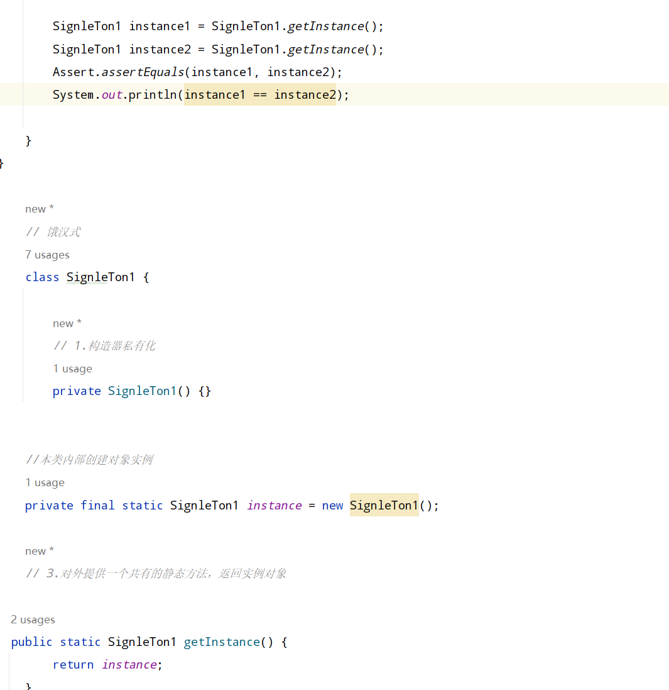
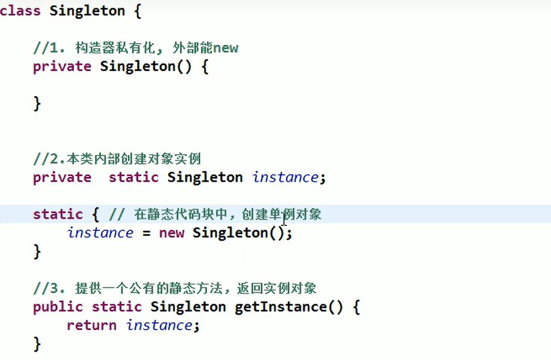
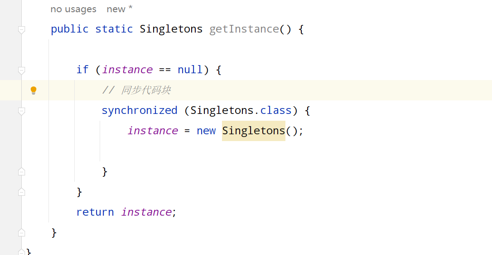
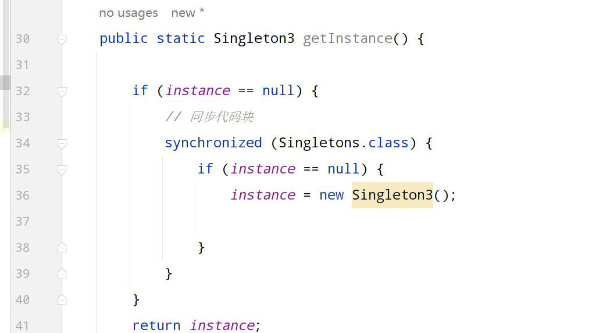
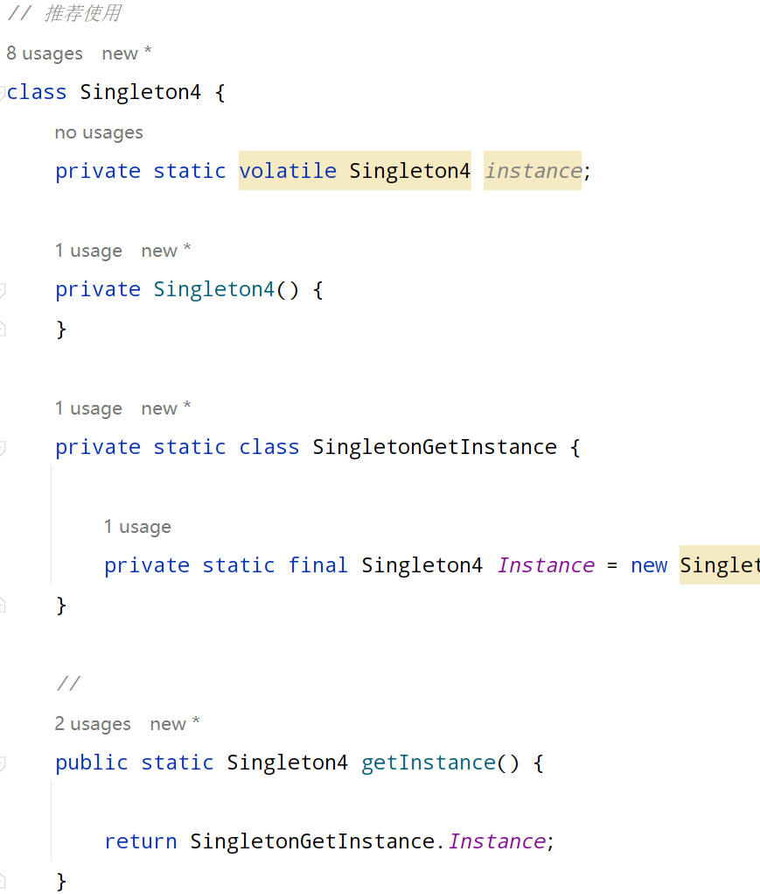

## 单例模式  
所谓类的单例设计模式，就是采取一定的方法保证在整个软件的系统中，对某个类只能存在一个对象实例，并且该类只提供一个取得对象实例的方法(静态方法)。  

比如Hibernate的SessionFactory,他充当数据存储源的代理，比负责创建Session对象。SessionFactory 并不是轻量级的，一般情况下，一项目通常只需要一个SessionFactory就够，这是就会使用到单例模式。  
### 单例模式的八种方式  
1) 饿汉式(静态常量)
2) 饿汉式(静态代码块)
3) 懒汉式(线程不安全)
4) 懒汉式(线程不安全，同步方法)
5) 懒汉式(线程安全,同步代码块)
6) 双重检查
7) 静态内部类
8) 枚举  
##### 饿汉式  
1) 构造器私有化(防止 new)
2) 类的内部创建对象
3) 向外暴露一个静态的公共方法。  
  
饿汉式(静态常量)  

##### 优缺点说明 
1) 优点：写法比较简单,在类装载的时候完成实例化，避免了线程同步问题。
2) 缺点:再类装载的时候完成实例化，没有达到懒加载的效果，如果从始至终从未使用过这个实例，则会造成内存浪费。
3) 这种方式基于classloader机制避免了多线程的同步问题，不过，instance在类装载时就实例化，在单例模式中大多数都是调用getInstance方法，但是导致类装载的原因有很多种，因此不能确定有其他的方式导致类装载，这时候初始化instance就没有达到懒加载的效果。  

###### 饿汉式(静态代码块)
    
 
#### 懒汉式(线程不安全)  
优缺点说明：  
1) 起到了lazy Loading 的效果，但是只能在单线程下使用。
2) 如果在多线程下，一个线程进入了判断语句块，还未来得及往下执行，另一个线程也通过了这个判断语句，这是会产生多个实例。
3) 结论：在实际开发中，不要使用这种模式,（加个synchronized，保证同步)。
###### 懒汉式(线程安全，同步代码块)    
  
###### 优缺点  
1.  不能起到线程同步的作用。 多线程时，会产生多个实例。  

#### DoubleCheck(双重检查)  
  
1.  代码只实例一次,后面再次访问时，判断if，后面直接return实例化对象，避免反复进行方法同步。  
2.  线程安全，延迟加载，效率较高。  
#### 静态内部类 完成单例模式  
  
##### 优缺点  
1.  这种方式采用了类转载的机制来保证初始化实例时只有一个线程。  
2. 静态内部类方式在Singleton类被加载时并不会立即实例化，而是在需要实例化时，调用getInstance方法,才会装载SingletonInstance类，从而完成Singleton的实例化。  
3. 类的静态属性只会在第一次加载类的时候初始化。再类进行初始化的时候，别的线程是无法进入的。
4. 优点：避免了线程不安全，利用静态内部类特点实现延迟加载，效率高。  
#### 单例模式--枚举   
1) 避免多线程同步问题。 防止反序列化重新创建的对象。  
### 注意事项  
1. 单例模式保证了系统内存种该类只存在一个对象，节省了系统资源，对于一些频繁创建销毁的对象，使用单例模式可以提高系统性能。
2. 当想实例化一个单例的时候，必须要记住使用相应的获取对象的方法，而不是使用new。
3. 单例模式使用场景：需要频繁的进行创建和销毁对象，创建对象时耗时过多或耗费用资源过多。