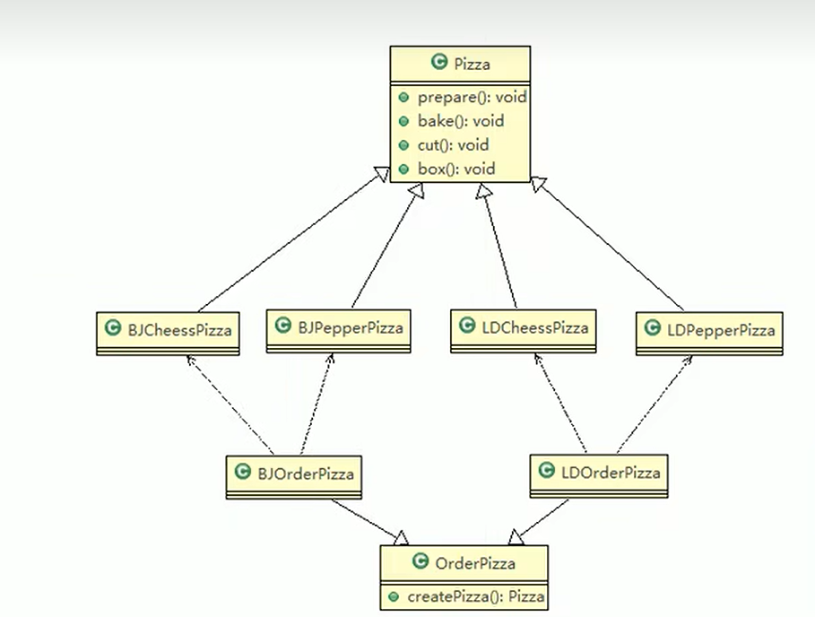
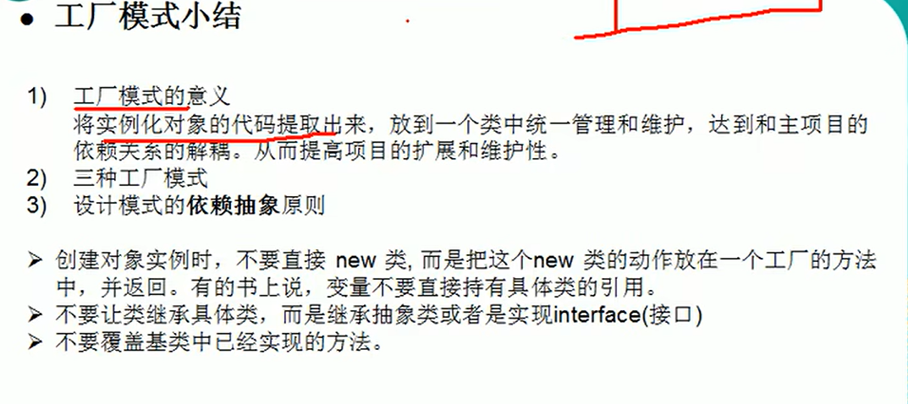

## 工厂模式  
### 简单工厂模式  
##### 传统方式的优缺点  
1. 优点是比较好理解，简单易操作。
2. 缺点是违反了设计模式的ocp原则，即对扩展开放，对修改关闭。即当我们给类新增加功能的时候,尽量不修改代码，或者尽可能少的修改代码。  
##### 简单工厂模式  
1. 简单工厂模式是属于创建型模式，是工厂模式的一种。简单工厂模式是由一个工厂对象决定创建出哪一种产品类的实例。  
2. 简单工厂模式：定义了一个创建对象的类，由这个类来封装实例化对象的行为。
3. 在软件开发种，当我们用到大量的创建某种，某类或者某批对象时，就会使用到工厂模式。  

#### 工厂方法模式   
将实例化功能抽象成工厂方法，在不同的接口中具体实现。  
定义了一个创建对象的抽象方法，由子类决定要实例化的类。工厂方法模式将对象的实例化推迟到子类。  
  
#### 抽象工厂模式  
1. 抽象工厂模式:定义了一个interface用于创建相关或有依赖关系的对象簇，而无需指明具体的类。
2. 抽象工厂模式可以将简单工厂模式和工厂方法模式进行整合。  
3. 从设计层面看，抽象工厂模式就是对简单工厂模式的改进
4. 将工厂抽象为两层，抽象工厂和具体实现的工厂子类，程序员可以根据创建对象类型使用对应的工厂子类，这样将单个的简单工厂类变成了工厂簇，更利于代码的维护和扩展。 
  

