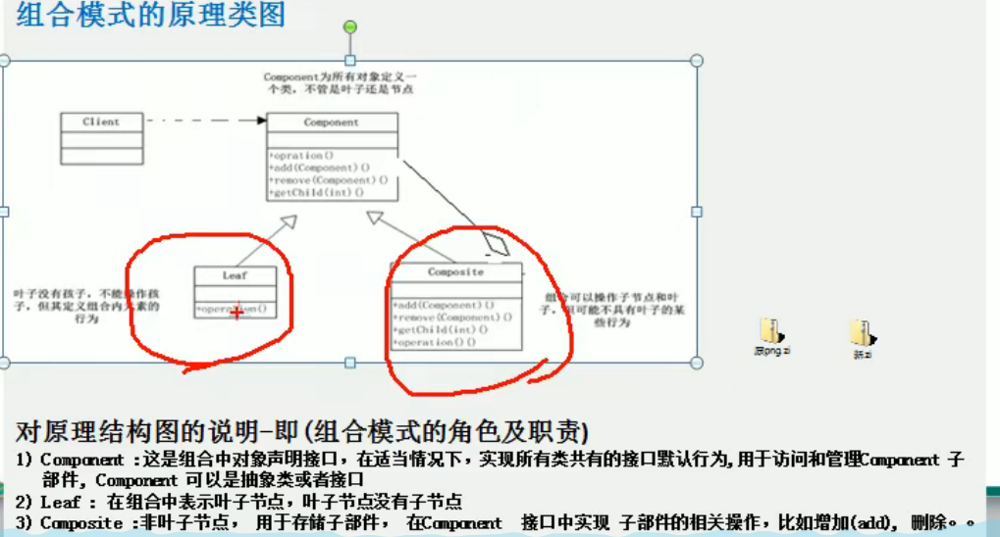

## 组合模式  
### 基本介绍  
组合模式，又叫部分整体模式，他是创建了对象组的树形结构，将对象组合成树状结构以表示”整体-部分“的层次关系。  
组合模式依据树形结构来组合对象，用来表示部分以及整体层次。 这种模式属于结构型模式。组合模式使得用户对单个对象和组合对象的访问具有一致性，即：组合能让客户以一致的方式处理个别对象以及组合对象。  
  
#### 解决的问题  
1. 对象生成一棵树形结构

