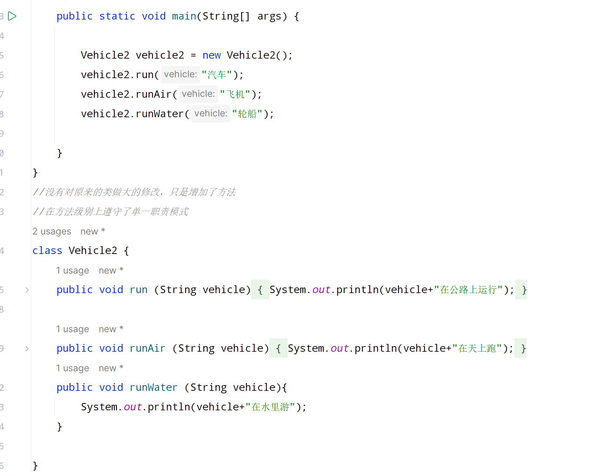
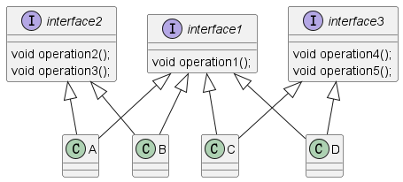
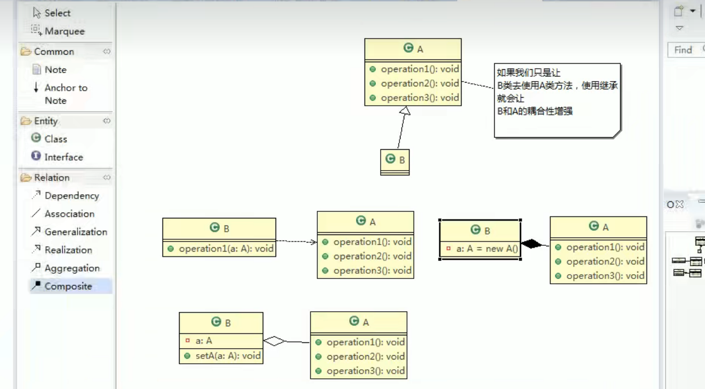

## JAVA设计模式

#### 一、设计模式的目的  
编写软件的过程中，程序员面临着来自耦合性，内聚性以及可维护性，可扩展性，重用性，灵活性等多方面的挑战。设计模式是为了让程序具有更好的.  
1)  代码重用性(相同功能的代码，不用多次编写)
2) 可读性(编程规范)
3) 可扩展性(增加新功能时，非常方便)
4) 可靠性
5) 使程序呈现高内聚，低耦合的特性   

### 二、设计模式的七大原则
1) 单一职责
2) 接口隔离原则
3) 依赖倒转原则
4) 里氏替换
5) 开闭原则
6) 迪米特原则
7) 合成复用原则

#### 2.1 单一职责模式  
对类来说，即一个类应该只负责一项职责，如类A负责两个不同职责:职责1，职责2。当职责1需求变更而改变A时，可能造成职责2执行错误，所以需要将类A的粒度分解为A1,A2.  
###### 应用
  
##### 说明和细节  
1) 降低类的复杂度，一个类只负责一项职责
2) 提高类的可读性，可维护性
3) 降低变更引起的风险
4) 通常情况下，我们应当遵守单一职责原则，只有逻辑足够简单，才可以在代码级违反单一职责;只有类中方法数量足够少，可以在方法级别中保持单一职责原则。  

#### 2.2接口隔离原则  
##### 基本介绍
1) 客户端不应该依赖它不需要的接口,即一个类对应另一个类的依赖应该建立在最小的接口上。

    

##### 2.3 依赖倒转原则  
###### 基本介绍  
依赖倒转是指：  
1) 高层模块不应该依赖低层模块，二者都应该依赖抽象。
2) 抽象不应该依赖细节，细节应该依赖抽象。  
3) 依赖倒转的中心思想是面向接口编程。
4) 相对于细节的多变性，抽象的东西要稳定的多，以抽象为基础搭建的架构比以细节为基础的架构要稳定的多。在Java中，抽象指的是接口或者抽象类，细节就是具体的实现类。  
5) 使用接口或抽象类的目的是制定好规范，而不涉及任何具体的操作，把展现细节的任务交给他们的实现类去完成。  
###### 依赖关系传递的三种方式  
1) 接口传递  
2) 构造方法传递  
3) setter方式传递  
###### 注意事项和细节  
1) 低层模块尽量都要抽象类或接口，或者两者都有，程序稳定性更好。
2) 继承时遵循里氏替换原则  
3) 变量的声明类型尽量是抽象类或者接口，这样我们的变量引用和实际对象间，就存在一个缓冲层，利于程序扩展和优化。

##### 2.4里氏替换原则   
1) 所有引用基类的地方必须能够透明地使用其子类的对象。  
2) 在使用继承时，遵循里氏替换原则，在子类中尽量不要重写父类的方法。
3) 继承实际上让两个类耦合性增强了，在适当的情况下，可以通过聚合，组合，依赖来解决问题。
4) 父类中凡是已经实现好的方法，实际上是在设定规范和契约，虽然他不能强制要求所有的子类必须遵循这些契约，但是如果子类对这些已经实现的方法任意修改，就会对整个继承体系造成破坏. 
5) 继承在给程序设计带来便利的同时，也带来了弊端。比如使用继承会给程序带来侵入性，程序的可移植性降低，增加对象间的耦合性，如果一个类被其他的类所继承，则当这个类需要修改时，必须考虑所有的子类，并且父类修改后，所有涉及到的子类的功能都有可能产生故障。  

#### 2.5 开闭原则  
##### 基本介绍  
1) 开闭原则 是编程中最基础，最重要的设计原则。  
2) 一个软件实体如类，模块，函数应该对扩展开放(对提供方)，对修改关闭(对使用方)，用抽象构建框架，用实现扩展细节。  
3) 当软件需要变化时，尽量通过扩展软件实体的行为来实现变化，而不是通过修改已经有的代码来实现。  
4) 编程中遵循其他原则，以及使用设计模式的目的就是遵循开闭原则。

#### 2.6 迪米特法则  
##### 基本介绍  
1) 一个对象应该对其他对象保持最少的了解
2) 类与类关系密切，耦合度越大
3) 对外除了提供的public方法，不对外泄露任何信息
4) 只与直接的朋友通信息.陌生的类最好不要以局部变量出现。  
###### 注意事项  
1) 迪米特法则的核心就是降低类之间的耦合，但是由于每个类都减少不了不必要的依赖，因此迪米特法则只是要求降低类间耦合关系，并不是要求完全没有依赖关系。  
#### 2.7合成复用原则  
原则是尽量使用合成/聚合的方式，而不是使用继承。    
   
### 核心思想  
1) 找出应用中可能需要变化之处，将他们独立出来，不要和那些不需要变化的代码混在一起。
2) 针对接口编程，而不是针对实现编程
3) 为了交互对象之间的松耦合设计而努力。

