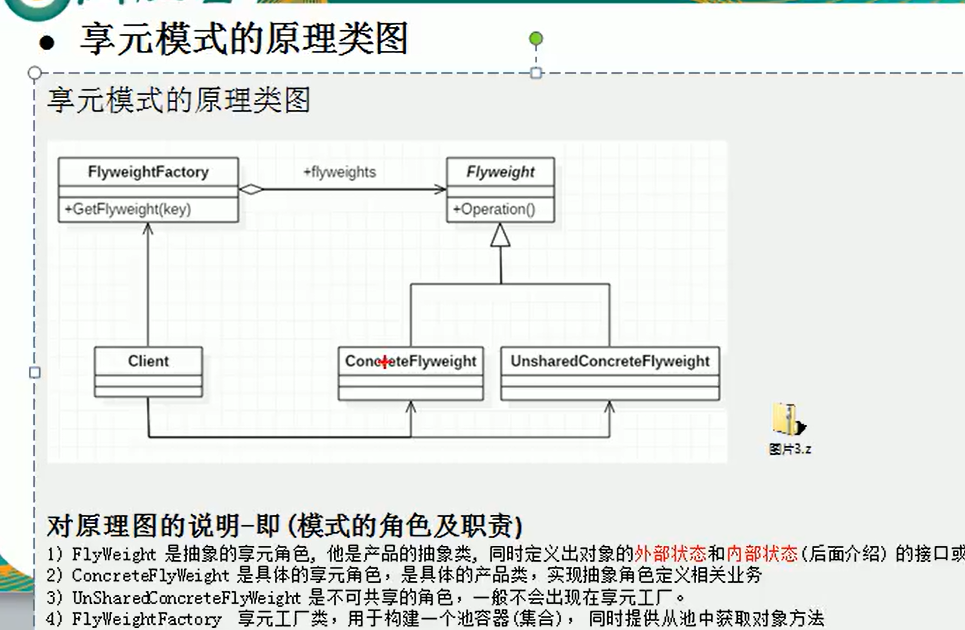

## 享元模式  
## 定义  
1. 享元模式，运用共享技术有效地支持大量细粒度地对象。
2. 常用于系统底层开发，解决系统的性能问题，向数据库连接池，里面都是创建好的连接对象，在这些连接对象中，有我们需要的则直接拿来用，避免重复创建
3. 享元模式能够解决重复对象的内存浪费问题,当系统中有大量相似对象，需要缓冲池时，不需要总是创建新对象，可以从缓冲池里拿，这样可以降低系统的内存，同时提高效率。  

##### 外部状态 
1. 享元模式提出了两个要求，细粒度和共享对象。这里就涉及到内状态和外部状态，即将对象的信息分为两个部分：内部状态和外部状态。
2. 内部状态是指对象共享出来的信息，存储在享元对象内部且不会随环境改变而改变的。
3. 外部状态指对象得以依赖的一个标记，是随环境改变而改变的，不可共享的状态。
