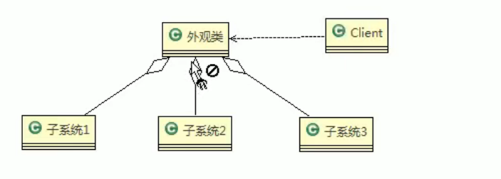

# 外观模式  
#### 定义  
外观模式，也叫过程模式。外观模式为子系统中的一组接口提供一个一致的界面，此默哀是定义了一个高层接口，这个接口使得这一子系统更加容易使用。  
外观模式通过定义一个一致的接口，用以屏蔽内部子系统的细节，使得调用端口只需跟这个接口发生调用，而无需关系这个子系统内部细节。  
  
#### 注意事项  
1. 外观模式屏蔽了子系统的细节,因此外观模式降低了客户端对子系统使用的复杂性
2. 外观模式对客户端与子系统的耦合关系，让子系统内部的模块更容易维护和扩展。
3. 通过合理的使用外观模式，可以帮助我们更好的划分访问的层次。
4. 当系统需要进行分层设计时，可以考虑使用Facade模式。
5. 在维护一个遗留的大型洗系统时，可能这个系统已经变得非常难以维护和扩展，此时可以考虑为新系统开发一个Facade类，来提供遗留系统的比较清晰的简单接口，让新系统与Facade类交互,提高复用性。
6. 不能过多的或者不合理的使用外观模式，使用外观模式好，还是直接调用模块好，要以让系统有层次，利于维护为目的。