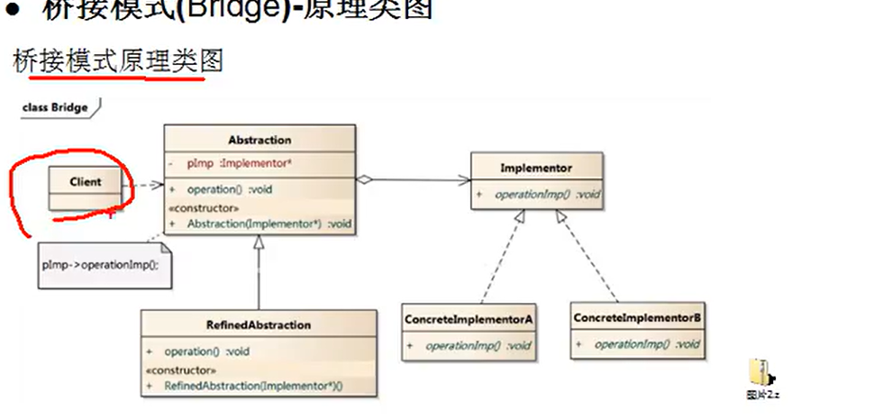

### 桥接模式  
#### 基本介绍  
1. 桥接模式是指：将实现与抽象放在两个不同的层次种，使两个层次可以独立改变。
2. 是一种结构型设计模式
3. Bridge模式基于类的最小设计原则,通过使用封装，聚合，及继承等行为让不同的类承担不同的职责。它的主要特点是把抽象与行为实现分离开来,从而可以保持各部分的独立性以及应对他们的功能扩展。
#### 原理图  
  
#### 注意事项和细节  
1. 实现了抽象和实现部分的分离，从而极大的提供了系统的灵活性，让抽象部分和实现部分分离开来,有助于系统进行分层设计，从而产生更好的结构化系统。
2. 对于系统的高层部分，只需要知道抽象部分和实现部分的接口就可以了，其他的部分有由具体化业务来完成。
3. 桥接模式替代多层集成方案,可以减少子类的个数，降低系统的管理和维护成本。
4. 桥接模式的引入增加了系统的理解和设计难度，由于聚合关联关系建立在抽象层,要求开发者针对抽象进行设计和编程。
5. 桥接模式要求正确识别出系统两个独立变化的维度，因此其适用范围有一定的局限性，即需要有这样的应用场景。